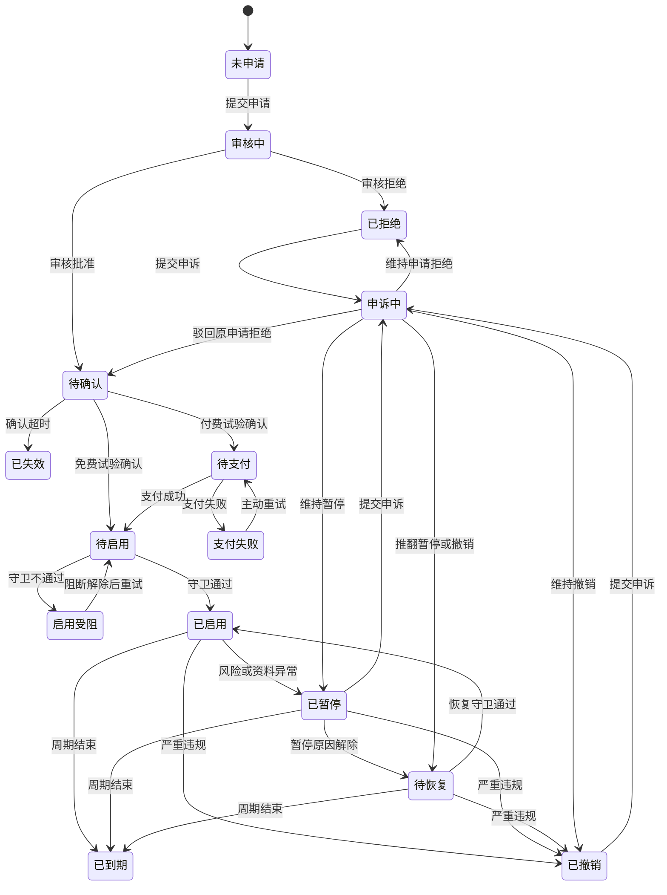
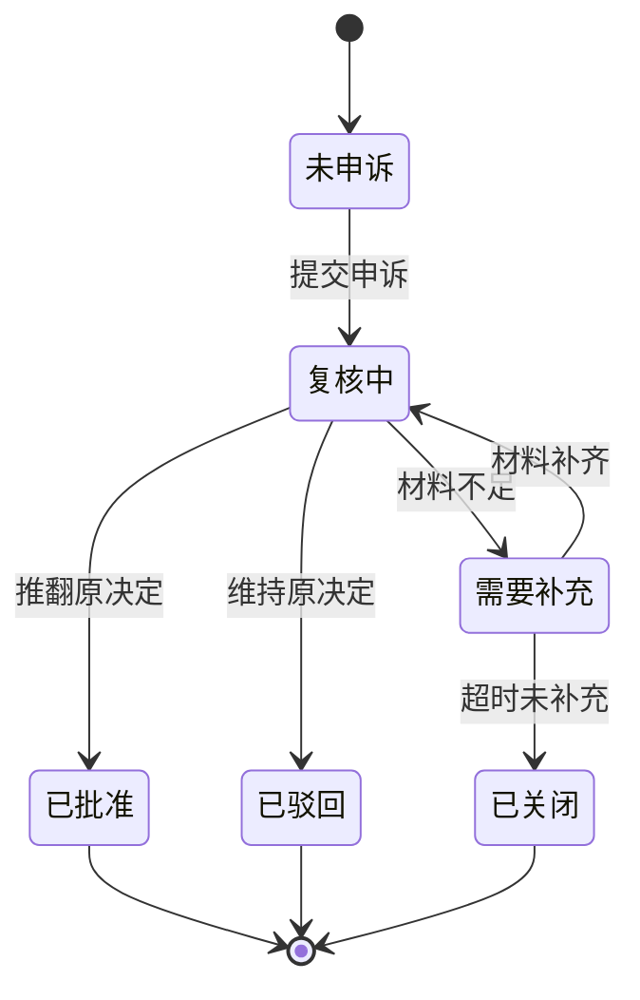
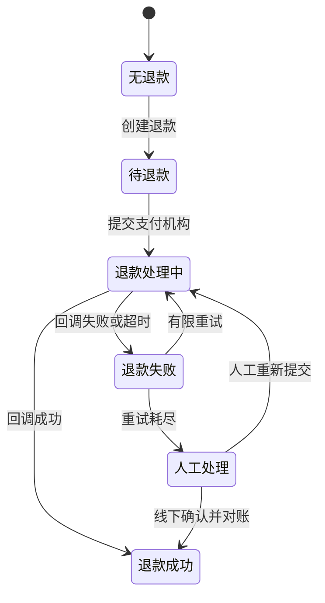
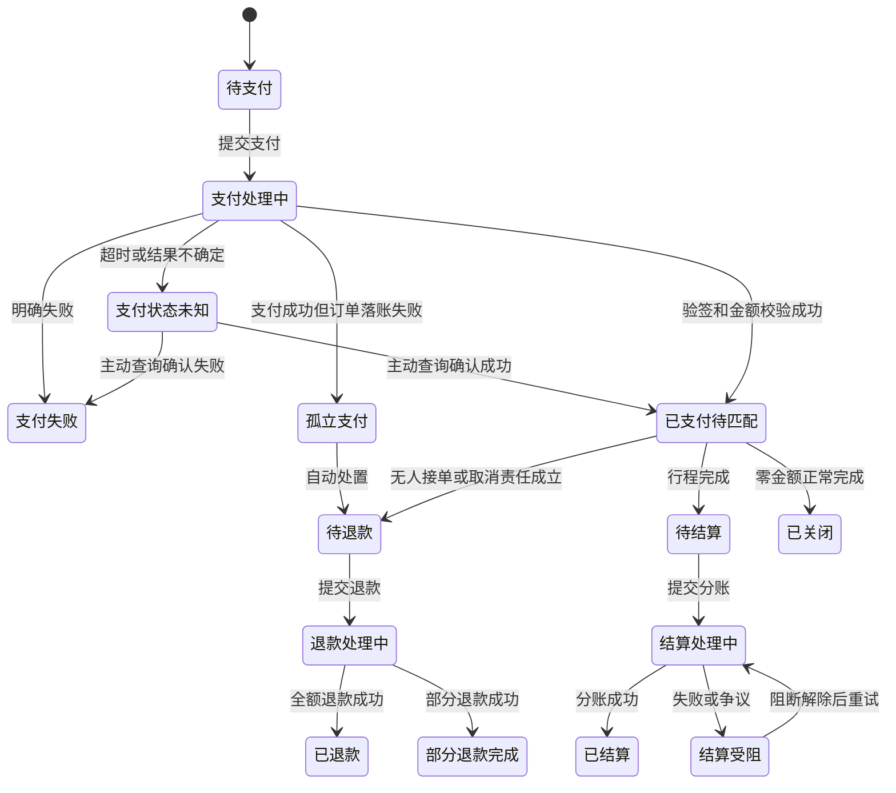
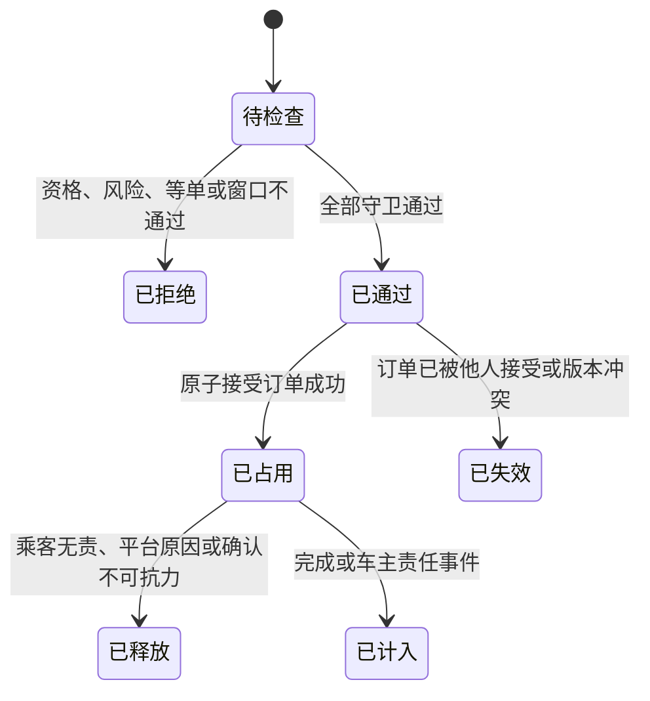

# 领域状态机

本文档定义 PollyCar 领域对象允许的状态、转换、守卫条件和并发优先级。事件字段由 `docs/08-domain-events.md` 定义，业务参数来源于 `docs/decisions/0001-弹性参与资格.md` 和 `docs/04-domain-model.md`。

当前状态机是“评审中方案”的可执行语义基线，不代表弹性参与资格已批准生产上线。

## 通用规则

- 状态只能通过明确命令和领域事件改变。
- 每次转换必须校验当前状态和聚合版本。
- 非法转换必须拒绝并记录原因，不得静默修正。
- 重复命令返回原结果，不重复收费、启用、暂停、退款或占用配额。
- 安全冻结优先于商业权益，已发生的支付不能阻止暂停或撤销。
- 时间驱动转换使用受控系统时钟和 UTC。
- 人工操作必须记录操作者、原因码和依据引用。

## 弹性资格主状态机

### 状态定义

| 状态 | 含义 | 是否使用弹性配额 |
| --- | --- | --- |
| 未申请 | 无申请或已满足重新申请条件 | 否 |
| 审核中 | 正在检查资格、履约、安全和职业化风险 | 否 |
| 已拒绝 | 申请未通过 | 否 |
| 待确认 | 审核通过，等待车主接受条款和价格 | 否 |
| 待支付 | 付费试验中等待资格费支付 | 否 |
| 支付失败 | 最近一次支付失败，可在确认有效期内重试 | 否 |
| 待启用 | 免费确认完成或支付成功，等待最终启用守卫检查 | 否 |
| 启用受阻 | 启用日、风险或资料条件阻止启用 | 否 |
| 已启用 | 资格生效，使用 4/12/18 上限 | 是 |
| 已暂停 | 风险调查、资料过期或指标异常 | 否 |
| 待恢复 | 暂停原因已解除，等待恢复守卫检查 | 否 |
| 申诉中 | 对拒绝、暂停或撤销决定进行复核 | 否 |
| 已撤销 | 因严重违规或欺诈终止资格 | 否 |
| 已到期 | 资格周期结束 | 否 |
| 已失效 | 确认超时或申请未完成 | 否 |

### 主流程

## 转换守卫

### 提交申请

必须同时满足：

- 车主和车辆资格有效。
- 不存在安全冻结和未结人工复核。
- 不存在进行中的弹性资格申请。
- 已拒绝或已撤销时已超过允许重新申请时间。
- 申请策略版本仍有效。

### 审核批准

必须同时满足：

- 成为合格车主至少 90 日。
- 最近 90 日完成不少于 8 单。
- 接受后完成率不低于 90%。
- 最近 90 日车主责任取消率不高于 5%。
- 最近 180 日无严重安全、线下收费、商业导流或身份车辆不一致。
- 职业化风险为低。
- 所需材料和复核均完成。

### 确认启用

- 车主必须主动接受当前条款和价格版本。
- 禁止默认自动续期。
- 确认必须发生在批准决定的有效期内。
- 免费试验不进入支付状态。
- 付费试验必须先进入待支付，不得直接启用。

### 最终启用

必须在同一原子检查中满足：

- 当前状态为待启用。
- 资格周期未开始或尚未结束。
- 车主、车辆和保险资料有效。
- 无安全冻结、撤销决定或人工复核阻断。
- 任意连续 90 日的已启用自然日累计少于 60 日。
- 付费试验支付已确认且未退款。
- 不存在另一个有效弹性资格周期。

### 恢复

- 原暂停原因已解除。
- 当前时间早于原资格结束时间。
- 不延长原周期结束时间，平台错误补偿除外。
- 恢复后不会使 90 日启用日超过 60 日。
- 无新的安全冻结或撤销决定。

## 状态允许操作

| 状态 | 允许操作 | 禁止操作 |
| --- | --- | --- |
| 未申请 | 提交申请 | 使用弹性配额 |
| 审核中 | 补充材料、撤回申请 | 重复申请、支付、启用 |
| 已拒绝 | 在期限内申诉、到期后重新申请 | 支付、启用 |
| 待确认 | 查看条款、确认或放弃 | 使用弹性配额 |
| 待支付 | 发起支付、取消确认 | 启用、重复创建有效支付 |
| 支付失败 | 重试支付、放弃 | 使用弹性配额 |
| 待启用 | 等待系统启用 | 接受超出基础上限的新订单 |
| 启用受阻 | 补充条件、申请退款 | 使用弹性配额 |
| 已启用 | 按弹性上限接单、主动放弃、申诉相关决定 | 叠加购买、延长周期、转让资格 |
| 已暂停 | 补充材料、申诉 | 使用弹性配额、续期 |
| 待恢复 | 等待恢复检查 | 使用弹性配额 |
| 申诉中 | 补充申诉材料 | 自动恢复、重复申诉 |
| 已撤销 | 在允许时申诉 | 使用资格、续期 |
| 已到期 | 重新申请 | 使用弹性配额、恢复旧周期 |
| 已失效 | 重新申请 | 恢复原确认 |

## 申诉子状态机

申诉是附着于原决定的独立复核流程。主状态进入“申诉中”时，必须保存原状态。

规则：

- 同一原决定只允许一次常规申诉。
- 申诉必须在决定通知后 7 个自然日内提交。
- 复核人不得是原决定人。
- 目标处理时限为 5 个工作日。
- 申诉不自动停止安全冻结，也不自动恢复弹性配额。
- 申诉批准时根据原决定恢复到待确认、待恢复或已到期，不得无条件进入已启用。

## 退款子状态机

退款状态独立于资格主状态，避免财务回调覆盖安全状态。

| 状态 | 含义 |
| --- | --- |
| 无退款 | 未创建退款 |
| 待退款 | 退款资格已确认 |
| 退款处理中 | 已向支付机构提交 |
| 退款成功 | 支付机构确认完成 |
| 退款失败 | 支付机构拒绝或超时 |
| 人工处理 | 自动重试耗尽或金额争议 |

规则：

- 同一原支付和退款范围只能存在一个有效退款。
- 退款成功不自动恢复、暂停或撤销资格。
- 资格撤销不自动产生退款，是否退款由退款规则决定。
- 支付机构迟到回调必须按支付请求和流水幂等处理。

## 订单支付状态机

### 资金模式

- `零金额测试`：只验证支付前置、退款语义、幂等和责任状态，不产生真实金融流水。
- `真实资金`：匹配前完成全额支付，完成或责任结论后进入退款或结算。
- 同一订单创建后不得切换资金模式；必须取消并创建新订单。

### 状态定义

| 状态 | 含义 | 是否允许进入匹配 |
| --- | --- | --- |
| 待支付 | 已锁定订单价格，尚未发起支付 | 否 |
| 支付处理中 | 支付请求已提交，等待确定结果 | 否 |
| 支付状态未知 | 超时或网络异常，必须主动查询 | 否 |
| 支付失败 | 已明确失败，可按策略重试 | 否 |
| 已支付待匹配 | 全额支付或零金额测试支付成功 | 是 |
| 待退款 | 已确定全部或部分退款责任 | 否 |
| 退款处理中 | 退款已提交 | 否 |
| 已退款 | 全额退款完成 | 否 |
| 部分退款完成 | 取消费保留，剩余退款完成 | 否 |
| 待结算 | 行程完成，资金等待分账 | 否 |
| 结算处理中 | 分账已提交 | 否 |
| 已结算 | 分账和账务记录完成 | 否 |
| 结算受阻 | 分账失败、争议或安全冻结 | 否 |
| 孤立支付 | 支付成功但本地订单未可靠创建 | 否 |
| 已关闭 | 零金额记录或无需资金动作的流程关闭 | 否 |

### 主流程

### 守卫与不变量

- 只有 `已支付待匹配` 状态的订单才能转换为“等待回应”。
- 支付状态未知时只能查询原支付，不得创建新支付以尝试覆盖。
- 支付回调必须校验签名、订单、金额、币种、环境和支付机构引用。
- 已支付金额必须等于订单锁定金额；不一致进入人工处置，不得进入匹配。
- 无人接单、平台原因、车主责任或确认不可抗力只能产生全额退款。
- 部分退款仅允许已批准的乘客责任取消费场景。
- 安全终止优先进入结算受阻或待人工责任判断，不自动分账。
- 支付、退款和分账状态只允许追加转换，不覆盖机构流水。
- 零金额测试和真实资金使用同一状态名称，但事件和记录必须携带 `funding_mode`。
- 生产环境不得接受零金额测试凭据，测试环境不得接受生产支付凭据。

### 并发优先级

- 支付成功与乘客取消同时发生：先确认支付事实，再根据取消责任创建退款，不丢失资金记录。
- 支付成功与订单创建失败同时发生：进入孤立支付并优先退款。
- 无人接单超时与车主接受同时发生：以订单接受事务版本决定；未成功接受则全额退款。
- 行程完成与安全终止同时发生：安全终止优先，资金进入结算受阻。
- 退款回调重复或乱序：按机构退款标识和本地版本幂等处理，不重复退款。
- 分账成功与退款请求同时发生：冻结自动处理并进入人工对账，不通过修改原流水解决。

## 配额判定状态机

配额判定是一次短生命周期决策，不保存为可长期修改的资格状态。

### 固定检查顺序

1. 车主账号资格有效。
2. 车辆、保险和绑定关系有效。
3. 无安全冻结、撤销或人工复核阻断。
4. 车主处于有效等单状态。
5. 读取弹性资格状态和版本。
6. 已启用使用 4/12/18；其他状态使用 3/10/15。
7. 原子检查 24 小时、7 日和 30 日窗口。
8. 原子接受订单并写入配额占用。
9. 持久化订单、配额和事件事实。

任一步失败都不得产生部分占用。

## 到期与在途订单

资格到期时：

- 已接受订单继续履约，不自动取消。
- 已接受订单继续占用并最终计入或释放。
- 后续接单立即使用基础上限 3/10/15。
- 若滚动计数已经高于基础上限，所有新接单请求被拒绝，直到计数自然回落。
- 结算、取消责任和安全处置不因到期改变。

## 暂停期间启用日计算

- 只有主状态为“已启用”的自然日计入 90 日内 60 日限制。
- 同一自然日曾处于已启用状态，无论持续多久，计 1 日。
- 整个自然日均处于已暂停、待恢复或其他非启用状态时，不计入。
- 同一自然日暂停后恢复，不重复计数。
- 自然日按试点城市运营时区计算，持久化时间仍使用 UTC。

## 并发与优先级

### 优先级顺序

同一资格发生并发命令或事件时，按以下优先级决定业务效果：

1. 严重安全撤销。
2. 安全暂停或人工风险阻断。
3. 周期到期。
4. 申诉决定。
5. 恢复和启用。
6. 支付成功或失败。
7. 用户主动放弃或普通资料更新。

高优先级不是覆盖历史事件，而是决定低优先级动作是否仍可改变主状态。

### 关键竞争场景

支付成功与安全暂停同时发生：

- 支付事实正常入账和审计。
- 资格不得进入已启用；进入启用受阻或已暂停。
- 根据责任和规则创建退款评估。

支付成功与确认失效同时发生：

- 以支付机构确认时间和确认截止时间比较。
- 截止时间前成功则进入待启用；截止时间后成功则不启用并创建全额退款。

恢复与到期同时发生：

- 到期优先，资格进入已到期。
- 不恢复旧周期；平台错误补偿通过新周期或退款处理。

接单与暂停同时发生：

- 接单事务必须比较资格聚合版本。
- 暂停先提交时，接单使用基础上限并重新判断。
- 接单先原子提交时，订单保持已接受，随后暂停阻止新接单。

到期与接单同时发生：

- 以资格结束时间和订单接受提交时间为准。
- 结束时间前原子提交成功可使用弹性上限。
- 结束时间及之后必须使用基础上限。

撤销与申诉批准同时发生：

- 比较决定所针对的版本。
- 旧申诉不得推翻后续新证据形成的撤销。
- 需要对最新撤销决定单独发起允许的申诉。

## 不变量

- 同一车主同一时刻最多有一个有效弹性资格周期。
- 只有“已启用”状态使用弹性配额。
- 付费、退款或申诉不能绕过安全暂停和撤销。
- 资格状态变化不释放既有配额占用。
- 资格到期不取消在途订单。
- 资格不能叠加、转让、囤积或默认自动续期。
- 任意连续 90 日已启用自然日不超过 60 日。
- 同一订单只能由一名车主成功接受。
- 配额窗口检查与订单接受必须原子完成。

## 状态机验证清单

- 每个允许转换都有对应领域事件。
- 每个拒绝路径有稳定原因码和用户可理解的中文提示。
- 重复命令不会产生重复收费、资格周期或配额占用。
- 所有时间边界覆盖刚好等于、早一毫秒和晚一毫秒场景。
- 所有并发场景验证聚合版本冲突和重试行为。
- 能够从事件链重建资格主状态、退款子状态和配额占用。
- 资格规则未批准前，生产功能开关保持关闭。

## 后续工作

1. 将状态和转换转为机器可检查规范。
2. 根据权限矩阵为每个命令定义授权策略。
3. 根据数据分类为 API、事件、日志和存储声明最高数据等级。
4. 根据状态机生成 API 契约和验收矩阵。
