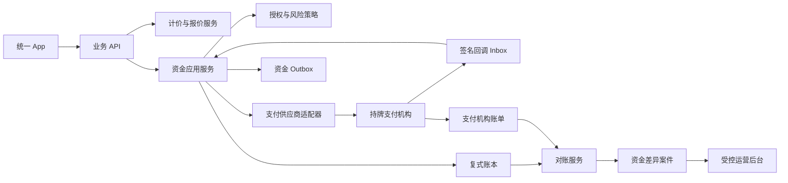
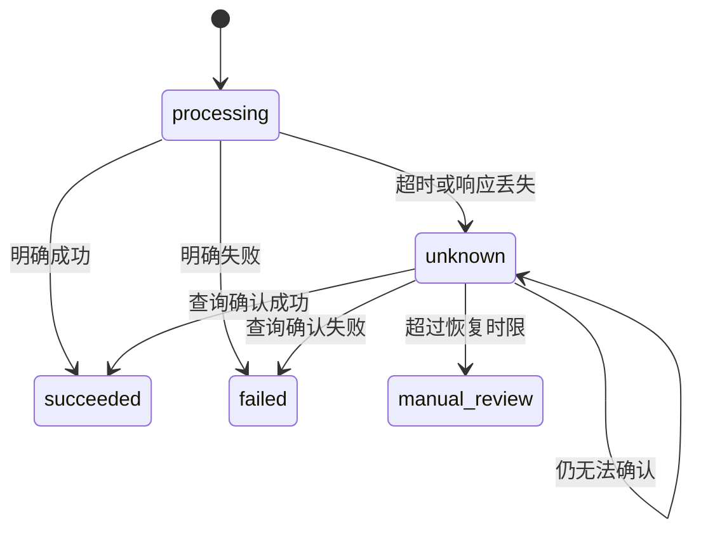

# 真实资金系统设计

## 文档状态

`已批准设计基线；禁止据此启用真实资金`

- 业务输入：`docs/decisions/0004-支付退款与取消责任.md`
- 设计目标：保证金额正确、资金请求合法、外部结果可验证、未知结果可恢复。
- 明确限制：真实支付机构、真实银行卡、真实提现、真实分账和生产密钥均未批准。

## 目标

真实资金系统必须同时保证：

1. **金额正确**：支付、退款、取消费、结算和提现金额只能来自 Server 权威规则。
2. **请求合法**：每个资金动作都有合法主体、业务原因、允许状态、权限和风险校验。
3. **只产生一次资金效果**：重复点击、重试、回调重放和任务重跑不会重复扣款、退款、分账或提现。
4. **结果可恢复**：超时和网络异常进入未知状态，通过查询原请求恢复，不盲目创建新请求。
5. **记录可审计**：业务状态、支付状态、账本、回调、任务和对账可以通过稳定引用关联。
6. **默认关闭**：未满足外部批准和生产门槛时，任何真实资金请求都不能到达支付机构。

## 非目标

- 不建立平台储值余额。
- 不允许用户向平台钱包充值。
- 不提供借贷、垫资、授信或证券能力。
- 不自行保存完整银行卡号、支付密码或支付机构敏感凭据。
- 不自行实现银行卡清算网络。
- 不通过修改历史资金流水修复错误。

## 核心不变量

### 金额不变量

- 所有人民币金额使用最小货币单位整数，字段统一以 `amount_minor` 结尾。
- TypeScript 资金领域使用受控 `Money` 值对象；跨进程传输使用十进制整数字符串，数据库使用 `bigint`。
- 禁止使用浮点数参与计价、分摊、退款、分账或余额计算。
- 每个金额必须携带 ISO 4217 币种；首期只允许 `CNY`。
- App 只能提交 `quote_id` 和确认动作，不能提交权威支付金额。
- 支付金额必须等于未过期、未消费的 Server 报价应付总额。
- 累计退款不得超过支付机构最终确认的成功金额。
- 累计结算和退款之和不得超过可处置资金。
- 分摊后的明细总和必须等于订单应付总额，尾差按固定、可审计规则分配。

### 请求合法性不变量

真实资金请求必须同时满足：

```text
生产门禁已批准
+ 会话有效
+ 成年资格通过
+ 账户和设备未冻结
+ 当前身份具有操作权限
+ 操作主体拥有目标资源
+ 业务状态允许
+ 报价或原资金单有效
+ 风险策略允许
+ 幂等键有效
+ 请求摘要与首次请求一致
```

任一条件不满足时，不得调用支付机构。

### 外部结果不变量

- 客户端跳转结果、前端成功页和 App 回调不能作为支付成功依据。
- 支付成功只能来自经过验签的支付机构回调，或 Server 使用原支付订单号主动查询得到的确定结果。
- 回调必须校验商户号、应用标识、平台订单号、支付机构订单号、金额、币种、事件 ID、签名和时间戳。
- 金额或币种不一致时不得自动入账，必须进入高优先级资金差异。
- 未知结果不能转换为失败后立即重试扣款。

### 资金记录不变量

- 资金状态和行程状态是两个独立状态机。
- 支付、退款、资金分配、运营主体清算、车主付款和拒付使用独立聚合，不存放在行程 JSON 中作为唯一事实。
- 每个已确认外部资金变化必须对应一笔复式账本交易。
- 每笔复式账本交易必须借贷平衡。
- 历史分录不可修改或删除，错误通过冲正和补充分录修复。

## 系统边界



### App 客户端

- 展示 Server 返回的报价、退款规则和预计到账说明。
- 只提交报价确认、支付方式令牌和幂等键。
- 不保存支付机构密钥。
- 不计算最终应付、退款、车主所得或可提现余额。
- 不把支付 SDK 返回的本地结果展示为最终支付成功。

### 计价与报价服务

负责生成不可变 `PriceQuote`：

| 字段 | 说明 |
| --- | --- |
| `quote_id` | 全局唯一报价 ID |
| `quote_version` | 报价规则版本 |
| `trip_draft_id` | 关联行程草稿 |
| `passenger_account_id` | 报价归属账户 |
| `currency` | 首期固定 `CNY` |
| `base_fare_minor` | 基础费用 |
| `time_adjustment_minor` | 时段调整 |
| `distance_adjustment_minor` | 路线调整 |
| `discount_minor` | 已批准优惠 |
| `tax_minor` | 税费 |
| `total_amount_minor` | 最终应付金额 |
| `expires_at` | 报价失效时间 |
| `pricing_rule_version` | 计价规则版本 |
| `route_snapshot_id` | 路线快照 |
| `status` | `active`、`consumed`、`expired`、`revoked` |

同一报价只能创建一个有效支付订单。路线、时间、人数、车辆等级或价格规则变化时必须生成新报价。

### 资金应用服务

负责：

- 创建支付订单。
- 创建支付尝试。
- 接收已验证回调。
- 查询未知结果。
- 创建退款、资金分配、运营主体清算和车主付款命令。
- 将确定结果写入账本。
- 生成资金 Outbox 和对账输入。

它不负责：

- 计算行程价格。
- 直接修改用户余额。
- 绕过账本写入业务结果。
- 接受运营人员输入任意金额执行扣款。

### 支付供应商适配器

定义供应商中立能力：

```text
createPayment
queryPayment
createRefund
queryRefund
createSettlement
querySettlement
createPayout
queryPayout
verifyCallback
downloadStatement
```

适配器必须返回标准化结果：

```text
succeeded
failed
processing
unknown
```

供应商专有错误只能映射为标准错误和受控诊断信息，不得泄漏密钥、完整请求报文或支付凭据。

## 领域模型

### 金额值对象（`Money`）

```text
currency
amount_minor
```

规则：

- `amount_minor` 必须是十进制整数。
- 一般金额必须大于或等于零。
- 负数不用于表达退款或冲正；方向由交易类型和借贷方向表达。

### 支付订单（`PaymentOrder`）

表示一次业务应付款：

```text
payment_order_id
business_type
business_id
payer_account_id
quote_id
amount
state
provider
provider_merchant_id
successful_attempt_id
paid_at
version
```

状态：

```text
created
processing
unknown
succeeded
failed
cancelled
partially_refunded
refunded
chargeback_pending
charged_back
```

### 支付尝试（`PaymentAttempt`）

表示一次向支付机构提交的外部请求：

```text
payment_attempt_id
payment_order_id
idempotency_key
request_fingerprint
provider_request_id
provider_payment_id
state
submitted_at
confirmed_at
failure_code
```

一个支付订单可以因明确失败而产生新的尝试，但同一未知尝试未查询清楚前不得创建新尝试。

### 退款单（`RefundOrder`）

退款必须引用原支付订单：

```text
refund_order_id
payment_order_id
reason_code
responsibility_decision_id
amount
state
provider_refund_id
requested_by
approved_by
```

状态：

```text
created
processing
unknown
succeeded
failed
manual_review
```

重复退款命令返回原退款单；不得使用负数支付单代替退款。

### 资金分配单（`RevenueAllocationOrder`）

表示从乘车人待履约资金转为平台、运营主体和车主经济权益等账务归属，不等同于支付机构已经向运营主体清算或向车主付款。

状态：

```text
blocked
ready
processing
succeeded
failed
reversed
```

安全冻结、责任争议、退款处理中和拒付处理中必须保持 `blocked`。

### 运营主体清算单（`OperatorSettlementOrder`）

表示支付机构把运营主体对应的 `85%` 外部资金清算到运营主体受控商户账户或结算路径。该状态不代表车主 `40%` 已经付款。

### 车主付款单（`DriverPayoutOrder`）

表示运营主体向车主已验证收款账户发起的真实付款。平台不建立车主钱包，也不使用“提现”表达该资金动作。

## 请求授权矩阵

| 操作 | 发起主体 | 必要条件 | 禁止主体 |
| --- | --- | --- | --- |
| 创建报价 | 已认证乘车人 | 成年资格通过、行程草稿归属本人 | 车主、运营人员代替用户定价 |
| 创建支付订单 | 已认证乘车人 | 报价归属本人且有效 | 车主、客服 |
| 确认支付结果 | 已验证支付回调或查询任务 | 验签、金额和引用一致 | App、普通运营人员 |
| 创建自动退款 | 责任规则引擎 | 责任结论确定、金额可退 | App 任意指定金额 |
| 创建例外退款 | 财务经办人 | 关联案件、原因码、权限 | 原责任认定人单独完成 |
| 批准例外退款 | 独立财务复核人 | 与经办人分离 | 同一经办人 |
| 创建结算 | 结算任务 | 行程完成、无冻结和争议 | 乘车人、车主、客服 |
| 创建提现 | 收益所有者 | 收款账户已验证、余额充足、风控通过 | 其他账户 |
| 资金冲正 | 财务经办人与复核人 | 原交易引用、原因和证据完整 | 单人直接修改余额 |

## 幂等设计

每个资金写请求保存：

```text
idempotency_scope
idempotency_key
actor_id
operation
resource_id
request_fingerprint
result_resource_id
response_snapshot
state
created_at
expires_at
```

处理规则：

- 同一作用域、幂等键和相同请求摘要：返回首次结果。
- 同一作用域、幂等键但请求摘要不同：拒绝并记录安全审计。
- 支付机构请求 ID、支付 ID、退款 ID和回调事件 ID建立唯一约束。
- 幂等记录与领域状态、账本和 Outbox 在同一事务提交。

## 回调 Inbox

原始回调先进入不可变 Inbox，再异步或事务内处理：

```text
provider
provider_event_id
merchant_id
received_at
signature_version
signature_verified
timestamp_verified
payload_digest
encrypted_payload_reference
processing_state
related_payment_order_id
```

规则：

- 验签失败不得改变业务状态。
- 重复事件返回成功接收，但只处理一次。
- 无法关联内部订单时创建孤立资金案件。
- 回调金额不一致时冻结相关支付订单和后续结算。
- 回调处理失败可以重试，但不得重复记账。

## 未知结果恢复



禁止行为：

- 将超时直接视为失败。
- 在未知状态创建新的相同扣款。
- 依赖用户截图确认支付。
- 由客服手动把状态改成成功。

## 数据存储边界

真实资金最少需要独立表：

```text
price_quotes
payment_orders
payment_attempts
payment_provider_callbacks
refund_orders
settlement_orders
payout_orders
financial_idempotency_records
financial_outbox
financial_cases
```

账本和对账表由另外两份设计定义。

## 安全与隐私

- 支付机构密钥只存在于 Server 密钥系统。
- App 和公开构建产物不得包含商户私钥、Webhook 密钥或账单下载凭据。
- 生产密钥按环境、应用和能力分离。
- 密钥必须支持轮换、吊销和泄漏演练。
- 完整银行卡信息尽量由支付机构托管，平台只保存支付令牌和掩码摘要。
- 日志不得记录完整卡号、验证码、支付凭据、签名密钥和原始敏感回调。
- 资金后台采用独立权限、强认证、短会话和高风险操作二次确认。
- 财务经办、复核、审计和开发权限相互分离。

## 可观测性

必须监控：

- 支付创建成功率和未知结果率。
- 回调验签失败和重放数量。
- 支付成功但本地未入账数量。
- 重复支付和重复退款拦截数量。
- 退款提交延迟和最终成功率。
- 结算阻塞、失败和重复拦截数量。
- 账本不平衡拒绝次数。
- 对账差异笔数和金额。
- 孤立支付、孤立退款和孤立回调数量。

监控指标不得使用用户手机号、身份证号、完整支付流水或银行卡信息作为标签。

## 验收标准

- App 修改金额不能改变支付订单金额。
- 报价过期、被消费或归属不符时不能创建支付订单。
- 同一支付请求并发执行只产生一个支付机构请求。
- 相同幂等键但不同金额或报价会被拒绝。
- 支付机构重复回调只产生一次状态变化和一笔账本交易。
- 支付未知时不会自动创建第二次扣款。
- 回调验签失败、商户号不符、金额不符或币种不符时不入账。
- 支付成功但订单创建失败会形成孤立支付案件和受控退款路径。
- 行程状态变化不能直接修改支付机构结果。
- 任何真实资金动作在功能门禁关闭时均被 Server 拒绝。

## 生效与退出条件

本设计只有在财务、税务、法律、安全和最终决策人批准后，才可以转换为机器契约和实施任务。

退出或重新设计条件：

- 支付机构无法支持查询、原路退款、验签、账单下载或稳定幂等。
- 平台法律角色要求改变收款、分账或资金保管模式。
- 真实资金必须进入平台自有余额或储值体系。
- 账务和支付机构无法通过稳定唯一引用逐笔关联。

## 评审结论与剩余阻断

| 原未决事项 | 收敛结论 | 状态 |
| --- | --- | --- |
| 平台、支付机构、乘车人和车主之间的资金法律关系 | 内部采用“持牌支付机构执行外部资金动作、平台不建立储值钱包”的候选；具体法律角色仍需书面意见 | 外部阻断 |
| 支付机构及支付产品选择 | 保持供应商中立；供应商必须支持支付、查询、验签、原路退款、账单和稳定唯一引用 | 外部阻断 |
| 固定价格计价规则和报价有效期 | Server 权威报价默认有效 10 分钟，创建支付订单后金额锁定 15 分钟 | 已收敛 |
| 服务费、税费、支付手续费和车主所得拆分 | 内部商业候选为平台 `15%`、运营主体 `45%`、车主 `40%`；支付手续费由平台承担，车主付款手续费由运营主体承担；法定会计和税务仍待专业签署 | 部分收敛 |
| 取消费是否启用及金额 | 首次真实资金封闭试验关闭取消费 | 已收敛 |
| 提现模式或支付机构直接分账模式 | 优先采用支付机构分账或付款能力，不建立平台储值钱包 | 已收敛 |

本设计的最终内部结论以 `docs/decisions/0013-真实资金架构与复式账本.md` 为准。

平台服务费、多运营主体、车主应付款和手续费承担的详细规则以 `docs/decisions/0014-平台服务费与多运营主体分成.md` 和 `docs/finance/04-服务费与多运营主体分成设计.md` 为准。
