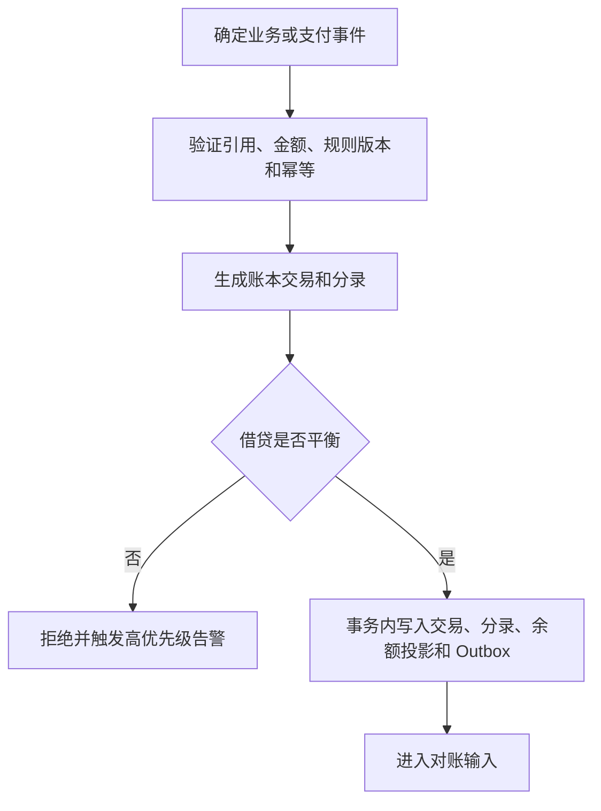

# 复式账本设计

## 文档状态

`已批准设计基线；禁止承载真实资金`

本设计定义 PollyCar 内部资金权威事实源。支付机构结果描述外部资金事实，复式账本描述平台对资金归属、应收、应付、收入、费用和退款义务的内部记录。业务页面展示的余额只能由账本派生，不得成为独立事实源。

## 设计目标

- 每一笔已确认资金变化都有平衡分录。
- 任何时点都可以解释资金来源、归属和去向。
- 历史记录不可覆盖，错误通过冲正修复。
- 重复事件不能重复记账。
- 业务订单、支付机构流水和账本交易可以稳定关联。
- 账本能够支持退款、部分退款、取消费、结算、分账、提现、拒付和争议冻结。

## 核心原则

### 账本是余额的唯一事实源

- 可提现余额、待结算金额和累计所得从账本分录计算或从受控余额投影读取。
- 余额投影可以重建，账本分录不能由余额反推后修改。
- 禁止使用 App 状态、行程 JSON 或支付机构单一状态作为车主余额。

### 借贷必须平衡

同一 `ledger_transaction` 内、同一币种的全部分录必须满足：

```text
借方金额合计 = 贷方金额合计
```

不平衡交易必须由数据库事务拒绝，不能先写入后补平。

### 只追加，不修改

- 已过账交易不可修改或删除。
- 错误通过完整冲正交易抵消，再创建正确交易。
- 冲正必须引用原交易。
- 不允许通过直接更新账户余额修复问题。

### 业务事实和账务事实分离

- 支付成功是外部支付事实。
- 行程完成是履约事实。
- 资金从待履约转为车主应付款和平台收入是账务事实。
- 三者通过稳定引用关联，但不共享同一状态字段。

## 金额模型

```text
Money {
  currency: "CNY"
  amount_minor: bigint
}
```

规则：

- `amount_minor` 非负。
- 借贷方向单独记录，不使用负数表达方向。
- 禁止浮点数。
- API 中使用十进制整数字符串，避免 JavaScript 安全整数边界问题。
- 分摊采用明确的整数舍入规则。
- 尾差必须进入指定科目或按固定顺序分配，并记录规则版本。

## 账户模型

### 账户类别

| 类别 | 正常余额方向 | 示例 |
| --- | --- | --- |
| 资产 | 借 | 支付机构待结算应收、银行存款、退款清算应收 |
| 负债 | 贷 | 乘车人待履约资金、车主应付款、退款应付款、税费应付款 |
| 收入 | 贷 | 平台服务费收入 |
| 费用 | 借 | 支付手续费、退款手续费、争议处理费用 |
| 权益 | 贷 | 仅在正式会计方案批准后使用 |

### 首期建议科目

| 科目代码 | 科目名称 | 类别 | 维度 |
| --- | --- | --- | --- |
| `ASSET_PROVIDER_RECEIVABLE` | 支付机构待结算应收 | 资产 | 支付机构、商户号、币种 |
| `ASSET_BANK_CASH` | 银行资金 | 资产 | 银行账户、币种 |
| `ASSET_REFUND_CLEARING` | 退款清算应收 | 资产 | 支付机构、币种 |
| `LIABILITY_PASSENGER_HELD` | 乘车人待履约资金 | 负债 | 支付订单、行程 |
| `LIABILITY_REFUND_PAYABLE` | 退款应付款 | 负债 | 退款单、乘车人 |
| `LIABILITY_OPERATOR_ENTITLEMENT` | 运营主体经营份额应付款 | 负债 | 运营主体、行程 |
| `LIABILITY_DRIVER_PAYABLE` | 车主应付款 | 负债 | 车主账户、行程 |
| `LIABILITY_PAYOUT_CLEARING` | 付款清算中间负债 | 负债 | 运营主体、付款单 |
| `LIABILITY_TAX_PAYABLE` | 税费应付款 | 负债 | 税种、期间 |
| `REVENUE_PLATFORM_SERVICE` | 平台服务费收入 | 收入 | 产品、城市、期间 |
| `EXPENSE_PROVIDER_FEE` | 支付手续费 | 费用 | 支付机构、产品 |
| `EXPENSE_OPERATOR_PAYOUT_FEE` | 车主付款手续费 | 费用 | 运营主体、付款机构 |
| `EXPENSE_DISPUTE` | 争议和拒付费用 | 费用 | 案件、支付机构 |

最终科目和会计处理必须由财务、税务和审计负责人批准。

## 账本实体

### 账本账户（`LedgerAccount`）

```text
ledger_account_id
account_code
account_type
currency
owner_type
owner_id
dimensions
dimension_key
state
created_at
```

`ledger_account_id` 使用 Server 生成的 UUID。`dimensions` 是只允许非空字符串值的 `jsonb` 对象，`dimension_key` 固定为 PostgreSQL `jsonb` 文本表示 `dimensions::text`，算法版本为 `postgres_jsonb_text_v1`。同一 `account_code + currency + owner_type + owner_id + dimension_key` 永久唯一，不因账户关闭而复用。

### 账本交易（`LedgerTransaction`）

```text
ledger_transaction_id
transaction_sequence
transaction_type
business_reference_type
business_reference_id
source_system
source_event_id
idempotency_key
request_digest
rule_version
occurred_at
posted_at
reversal_of_transaction_id
initiator_type
reason_code
review_reference
state
```

`transaction_sequence` 使用 PostgreSQL `bigint generated always as identity`。`source_system + source_event_id + transaction_type` 组合必须唯一，防止不同来源命名空间冲突。`idempotency_key + transaction_type` 唯一；重复键只有在 `request_digest` 相同时返回原结果，摘要不同时拒绝。

### 账本分录（`LedgerEntry`）

```text
ledger_entry_id
ledger_transaction_id
ledger_account_id
direction
amount_minor
currency
entry_sequence
```

`direction` 只能是 `debit` 或 `credit`。

### 账本余额投影（`LedgerBalanceProjection`）

用于查询性能：

```text
ledger_account_id
debit_total_minor
credit_total_minor
balance_minor
last_transaction_sequence
updated_at
```

`balance_minor = debit_total_minor - credit_total_minor`，允许为负数。资产和费用正常余额为正，负债、收入和权益正常余额为负；面向业务展示的正常方向余额由账户类别转换，不改变投影存储口径。投影不是权威流水，必须可以从分录重建。

## 阶段二实施冻结

本节是阶段三数据库原型和阶段四正式实现的唯一技术方案，不再保留其他候选。

### PostgreSQL Schema 与表

账本对象统一位于 `pollycar_finance` Schema：

| 对象 | 固定名称 | 关键规则 |
| --- | --- | --- |
| 账户表 | `pollycar_finance.ledger_accounts` | UUID 主键；完整身份永久唯一；只能从 `open` 转为 `closed` |
| 交易表 | `pollycar_finance.ledger_transactions` | UUID 主键；全局 `bigint identity` 序列；只保存 `posted` |
| 分录表 | `pollycar_finance.ledger_entries` | 每笔金额大于零；借贷方向分离；交易内序号唯一 |
| 余额投影表 | `pollycar_finance.ledger_balance_projections` | 每账户一行；与分录和 Outbox 同事务更新 |
| 运行时过账函数 | `pollycar_finance.post_runtime_ledger_transaction(p_request jsonb)` | 唯一运行时资金写入入口；阶段八交易在此校验对账批次 |
| 内部核心函数 | `pollycar_finance.post_ledger_transaction(p_request jsonb)` | 只由运行时包装函数调用；运行时角色无直接执行权 |
| 平衡校验函数 | `pollycar_finance.assert_ledger_transaction_balanced` | 延迟到事务提交时校验 |
| 不可变触发器函数 | `pollycar_finance.reject_ledger_mutation` | 拒绝交易和分录更新、删除 |

所有 UUID 由 Server 生成，数据库不安装用于生成标识或计算 `dimension_key` 的扩展。金额和累计金额使用 `bigint`；任何加总溢出立即以 `LEDGER_AMOUNT_OVERFLOW` 拒绝，不允许截断或转浮点数。

### 账户复合维度

`dimensions` 只允许对象，键和值均为非空字符串，不允许数组、数字、布尔值、嵌套对象或 `null`。`dimension_key` 等于 `dimensions::text`，由数据库生成或验证，禁止调用方单独提交另一个摘要值。

| 科目 | 必需维度键 |
| --- | --- |
| `ASSET_PROVIDER_RECEIVABLE` | `provider_id`、`merchant_account_id` |
| `ASSET_BANK_CASH` | `legal_entity_id`、`bank_account_ref` |
| `ASSET_REFUND_CLEARING` | `provider_id`、`merchant_account_id` |
| `LIABILITY_PASSENGER_HELD` | `payment_order_id`、`trip_id` |
| `LIABILITY_REFUND_PAYABLE` | `refund_order_id`、`passenger_account_id` |
| `LIABILITY_OPERATOR_ENTITLEMENT` | `operator_id`、`trip_id` |
| `LIABILITY_DRIVER_PAYABLE` | `driver_account_id`、`trip_id` |
| `LIABILITY_PAYOUT_CLEARING` | `operator_id`、`payout_order_id` |
| `LIABILITY_TAX_PAYABLE` | `tax_type`、`accounting_period` |
| `REVENUE_PLATFORM_SERVICE` | `product_code`、`city_code`、`accounting_period` |
| `EXPENSE_PROVIDER_FEE` | `provider_id`、`provider_product` |
| `EXPENSE_OPERATOR_PAYOUT_FEE` | `operator_id`、`payout_provider_id` |
| `EXPENSE_DISPUTE` | `case_id`、`provider_id` |

维度键必须与科目精确匹配，不允许少键或额外键。账户身份字段和维度创建后永久不可变；关闭账户不得继续过账，也不得创建相同身份的新账户。账户关闭唯一入口为 `pollycar_finance.close_ledger_account(p_ledger_account_id uuid, p_reason text)`，仅 `pollycar_ledger_maintenance` 可以执行，状态只能从 `open` 转为 `closed`。

### 来源系统与交易类型

`source_system` 只允许：

- `payment_aggregate`
- `trip_fulfillment`
- `refund_aggregate`
- `provider_settlement`
- `payout_aggregate`
- `reconciliation`
- `manual_finance`

`transaction_type` 只允许：

- `PAYMENT_SUCCEEDED`
- `PROVIDER_SETTLED_WITH_FEE`
- `REFUND_LIABILITY_CREATED`
- `REFUND_COMPLETED`
- `FULL_REVERSAL`
- `ALLOCATION_15_45_40`
- `DRIVER_PAYOUT_REQUESTED`
- `DRIVER_PAYOUT_COMPLETED`

阶段六以前不得执行基础交易模板；`ALLOCATION_15_45_40` 和车主付款交易必须等待阶段七对账门禁通过后进入阶段八。

### 请求摘要

`request_digest` 使用 SHA-256 小写十六进制。输入严格采用 RFC 8785 JSON Canonicalization Scheme 的 UTF-8 字节：

1. 使用 RFC 8785 规定的对象键排序、字符串转义和 JSON 序列化。
2. 分录按 `entry_sequence` 升序。
3. 金额使用十进制整数字符串。
4. 可选字段使用固定对象结构并显式写入 `null`，禁止因调用方省略字段产生不同摘要。
5. 包含交易类型、业务引用、来源系统与事件、规则版本、事件时间、发起类型、冲正引用、原因、复核引用和全部分录。
6. 排除幂等键、数据库标识、全局序列、过账时间和 Outbox 标识。

应用计算摘要，数据库保存并比较摘要。同一 `idempotency_key + transaction_type` 且摘要一致时返回原交易；摘要不一致时返回 `LEDGER_IDEMPOTENCY_CONFLICT`。

### 唯一过账函数

唯一运行时入口固定为：

```text
pollycar_finance.post_runtime_ledger_transaction(p_request jsonb)
  -> ledger_transaction_id uuid
  -> transaction_sequence bigint
  -> replayed boolean
```

函数使用 `SECURITY DEFINER`，固定 `search_path = pg_catalog, pollycar_finance`，并撤销 `PUBLIC` 的默认执行权限。Outbox 使用完全限定表名 `public.pollycar_outbox`，不把可被其他角色创建对象的 `public` 放入安全定义函数搜索路径。函数必须在一个数据库事务内依次完成：

1. 验证门禁、请求结构、枚举、金额、币种、规则版本和摘要。
2. 查询幂等结果；相同摘要返回原结果，不同摘要拒绝。
3. 按完整账户身份解析或创建开放账户，并按账户 UUID 升序锁定。
4. 插入状态为 `posted` 的账本交易和全部分录。
5. 原子更新余额投影。
6. 写入 `finance.ledger.transaction_posted` Outbox，事件 ID 为 `ledger-posted:{ledger_transaction_id}`。
7. 返回交易 ID、全局序列和是否重放。

应用运行时不得直接对账户、交易、分录或余额投影执行 `INSERT`、`UPDATE` 或 `DELETE`。Repository 必须要求显式 `PostgresTransaction` 上下文，不允许回退到连接池自动提交。

### 延迟平衡与不可变约束

平衡约束使用 `DEFERRABLE INITIALLY DEFERRED` 的约束触发器，在事务提交时验证：

- 每笔交易至少两条分录。
- 每个币种借方合计等于贷方合计。
- 分录币种与账户币种一致。
- 所有账户仍为 `open`。

函数内先执行相同校验以返回稳定错误，延迟约束触发器作为无法绕过的数据库后盾。交易和分录表的 `BEFORE UPDATE OR DELETE` 触发器统一调用 `reject_ledger_mutation` 并返回 `LEDGER_IMMUTABLE`。应用角色无权禁用触发器、替换函数或变更角色成员关系。

### 完整冲正

冲正仍通过 `post_ledger_transaction`，交易类型必须为 `FULL_REVERSAL`：

- 请求必须引用一笔未被冲正的原交易。
- 调用方不得提交冲正分录。
- 数据库从原分录复制金额、币种、账户和序号，并交换借贷方向。
- 原交易不能是冲正交易。
- 一个原交易最多存在一笔完整冲正，使用 `reversal_of_transaction_id IS NOT NULL` 的唯一索引保证。
- 所有冲正必须提供原因码；`finance_manual` 发起时还必须提供独立复核引用。

### 数据库角色

| 数据库角色 | 权限 | 明确禁止 |
| --- | --- | --- |
| `pollycar_ledger_owner` | 无登录；拥有 Schema、表、触发器和函数 | 成为运行时角色或处理业务请求 |
| `pollycar_ledger_runtime` | `USAGE`、账本只读、执行过账函数 | 表直接写入、禁用触发器、替换函数、变更角色 |
| `pollycar_ledger_maintenance` | 无登录；只读并执行余额投影重建函数 | 修改交易或分录 |
| `pollycar_ledger_auditor` | 无登录；账本只读 | 执行资金函数或修改表 |

本机阶段三原型可以由数据库所有者创建这些角色，但验证必须使用 `pollycar_ledger_runtime` 执行过账和越权测试。

余额投影重建唯一入口为 `pollycar_finance.rebuild_ledger_balance_projections()`，只允许 `pollycar_ledger_maintenance` 执行。重建函数不得修改交易和分录，必须在受控事务中从全部已过账分录重新生成投影。

## 阶段三数据库不变量原型证明

阶段三使用一次性本机 PostgreSQL 17 容器和独立数据库 `pollycar_ledger_stage3`。阶段三通过后，同一已验证 SQL 被提升为正式迁移 `apps/server/migrations/0007_financial_ledger.sql`；阶段三证明本身仍不接入 App、真实数据或生产运行时。

统一证明命令：

```powershell
pnpm test:ledger:stage3
```

该命令创建随机命名的 Podman 容器、动态分配本机端口、运行十项真实 PostgreSQL 验收并删除容器。原型 SQL 在执行任何清理前检查数据库名必须为 `pollycar_ledger_stage3`。

已通过场景：

1. 合法平衡交易通过唯一过账函数，并在同一事务生成余额投影和 Outbox。
2. 借贷不平交易被拒绝。
3. 单分录交易被拒绝。
4. 重复来源事件被拒绝。
5. 同一幂等键对应不同摘要时被拒绝。
6. 相同幂等键和摘要返回原交易，不重复入账。
7. 数据库管理员直接修改已过账交易或分录仍被不可变触发器拒绝。
8. 运行时角色不能直接写表或禁用触发器。
9. 绕过过账函数的单分录交易在事务提交时被延迟约束拒绝。
10. 完整冲正由数据库复制反向分录，并拒绝二次冲正、冲正冲正和调用方自带冲正分录。

阶段三证明只确认数据库不变量方案可行，不单独代表正式迁移、Repository、运行时接入、并发恢复或生产启用已经完成。

## 阶段四持久化内核实现

阶段四已将冻结模型落入正式迁移和 Server 持久化层，但未接入 App、HTTP API、真实资金事件或生产数据库：

- 正式迁移为 `apps/server/migrations/0007_financial_ledger.sql`，由现有 `runMigrations()` 顺序执行。
- 账本领域端口为 `apps/server/src/ports/ledger.ts`，正式实现为 `apps/server/src/persistence/postgres-ledger-repository.ts`。
- `PostgresLedgerRepository.post()` 必须取得 `PostgresTransaction.requireCurrentClient()`；事务外调用固定抛出 `LEDGER_TRANSACTION_REQUIRED`，不得退化为连接池自动提交。
- Repository 只调用 `pollycar_finance.post_runtime_ledger_transaction(jsonb)`，不直接插入交易、分录、余额投影或 Outbox，也不提供直接余额修改方法；运行时角色不能直接执行内部核心函数。
- 数据库函数在同一事务同步写入交易、分录、余额投影和 `public.pollycar_outbox`；任一步失败或上层业务事务回滚时四者全部回滚。
- `createPostgresRuntime()` 只注册 Repository 供后续应用服务使用，不创建账本 HTTP 路由，不启用任何真实支付、结算、付款或生产能力。

统一验证命令：

```powershell
pnpm test:ledger:stage4
```

该命令在一次性本机 PostgreSQL 17 容器中执行 `0001` 至 `0007` 全部正式迁移，并验证事务外拒绝、事务内四类记录原子提交及强制回滚后零残留。

## 阶段五并发、重建与故障恢复验证

阶段五在唯一过账函数中增加两类事务级 advisory lock：

- 幂等锁由交易类型和 `idempotency_key` 共同确定，保证相同请求并发时后到事务读取并返回原交易。
- 来源事件锁由交易类型、`source_system` 和 `source_event_id` 共同确定，保证不同幂等键不能并发消费同一来源事件。
- 两类锁都由 PostgreSQL 在事务提交或回滚时自动释放，不建立应用内锁、独立锁表或第二写入路径。
- 唯一索引继续作为最终数据库防线；advisory lock 用于把预期业务冲突稳定转换为 `replayed`、`LEDGER_SOURCE_EVENT_CONFLICT` 或 `LEDGER_IDEMPOTENCY_CONFLICT`。

统一验证命令：

```powershell
pnpm test:ledger:stage5
```

该命令创建一次性本机 PostgreSQL 17 容器，依次完成：

1. 两个独立数据库事务并发提交相同请求，返回同一交易编号和全局序列，其中一次标记为重放。
2. 并发来源事件冲突和幂等摘要冲突均只保留一笔交易，并返回稳定账本错误。
3. 删除全部余额投影后，以维护角色调用唯一重建函数，重建结果与增量投影逐账户一致，交易和分录数量不变。
4. 强制业务事务回滚后，交易、分录和 Outbox 均无残留。
5. 写入固定恢复基准交易后真实重启 PostgreSQL 容器。
6. 重启后确认交易、分录、投影和 Outbox 持久存在，再次提交相同请求返回原交易且不产生第二笔记录。

阶段五验证不接入 App、真实资金、真实数据或生产数据库。阶段六才允许在该内核上实现已批准的基础合成交易模板。

## 阶段六基础合成交易模板实现

阶段六新增 `SyntheticLedgerTemplateService`，仅提供以下五个过账方法：

- `postPaymentSucceeded()`：借记支付机构待结算应收，贷记乘车人待履约资金。
- `postProviderSettledWithFee()`：借记银行资金和支付机构手续费，贷记支付机构待结算应收；净额与手续费之和必须等于清算总额。
- `postRefundLiabilityCreated()`：借记乘车人待履约资金，贷记退款应付款。
- `postRefundCompleted()`：借记退款应付款；原支付未清算时贷记支付机构待结算应收，已清算时贷记退款清算资产，调用方必须明确提供清算状态。
- `postFullReversal()`：只提交原交易引用、原因码和复核引用，冲正分录继续由数据库从原交易完整生成。

所有模板固定使用 `CNY`、十进制整数字符串、固定来源系统、固定规则版本、固定分录顺序和冻结账户维度。模板服务只通过 `LedgerRepository` 过账，并由 `Transaction.run()` 创建显式事务；它已注册到 PostgreSQL 内部运行时，但未接入 App 或 HTTP API。

统一验证命令：

```powershell
pnpm test:ledger:stage6
```

阶段六完成时，真实 PostgreSQL 17 已验证五类基础交易均通过唯一数据库入口写入交易、分录、投影和 Outbox，完整冲正与原交易账户和金额相同、方向相反；当时 `ALLOCATION_15_45_40`、`DRIVER_PAYOUT_REQUESTED` 和 `DRIVER_PAYOUT_COMPLETED` 尚未实现，阶段六数据库验收确认三类交易写入数量均为零。三类交易现已在下述阶段八实现中启用。

## 阶段八多运营主体资金编排实现

阶段八在阶段七对账门禁验收通过后实现三类追加式交易模板：

- `ALLOCATION_15_45_40`：借记乘车人待履约资金，贷记平台服务费、运营主体经营份额和车主应付款；平台与运营主体分别向下取整，全部尾差进入车主份额。
- `DRIVER_PAYOUT_REQUESTED`：按付款批次内每笔行程借记车主应付款，汇总贷记付款清算中间负债。
- `DRIVER_PAYOUT_COMPLETED`：借记付款清算中间负债，付款手续费另行借记运营主体付款费用，合计贷记运营主体银行资金；手续费不减少车主应付款。

三类模板继续只调用 `LedgerRepository` 和 `pollycar_finance.post_runtime_ledger_transaction(p_request jsonb)`；包装函数先执行数据库对账门禁，再调用内部核心函数，因此交易、分录、余额投影和 Outbox 保持原子写入。运营主体关系、资金分配单、清算批次、车主付款批次和资金案件只保存编排状态、派生金额与账本交易引用，不建立运营主体余额、车主余额、钱包或第二套余额投影。

统一验证命令：

```powershell
pnpm test:ledger:stage8
```

隔离的本机 PostgreSQL 17 验证固定 `15%/45%/40%` 分配、尾差、主运营唯一关系、对账门禁、双人复核、付款手续费、重复入批拒绝、运行时禁止直接写表和提前结算关闭态。真实运营主体、真实清算、真实付款和生产启用继续关闭。

## 标准交易模板

以下示例用于验证借贷关系。平台、运营主体和车主的经济分配采用 `docs/decisions/0014-平台服务费与多运营主体分成.md` 的内部候选规则；法定会计总额或净额确认仍需专业批准。

### 支付成功

乘车人支付 `100.00 元`：

| 借贷 | 科目 | 金额 |
| --- | --- | --- |
| 借 | 支付机构待结算应收 | `100.00` |
| 贷 | 乘车人待履约资金 | `100.00` |

业务含义：支付机构确认已收款，但行程尚未完成，平台不能把全部金额确认成收入。

### 支付机构清算并扣除手续费

支付机构结算 `98.00 元`，手续费 `2.00 元`：

| 借贷 | 科目 | 金额 |
| --- | --- | --- |
| 借 | 银行资金 | `98.00` |
| 借 | 支付手续费 | `2.00` |
| 贷 | 支付机构待结算应收 | `100.00` |

### 行程完成并确认资金归属

订单可分配金额为 `100.00 元`，平台服务费 `15.00 元`、运营主体经营份额 `45.00 元`、车主应付款 `40.00 元`：

| 借贷 | 科目 | 金额 |
| --- | --- | --- |
| 借 | 乘车人待履约资金 | `100.00` |
| 贷 | 平台服务费收入 | `15.00` |
| 贷 | 运营主体经营份额应付款 | `45.00` |
| 贷 | 车主应付款 | `40.00` |

该分录表达跨主体经济权益分配，不直接替代平台和运营主体各自法定总账中的总额或净额收入确认。

### 全额退款责任形成

| 借贷 | 科目 | 金额 |
| --- | --- | --- |
| 借 | 乘车人待履约资金 | `100.00` |
| 贷 | 退款应付款 | `100.00` |

退款机构确认完成后：

| 借贷 | 科目 | 金额 |
| --- | --- | --- |
| 借 | 退款应付款 | `100.00` |
| 贷 | 支付机构待结算应收或退款清算资产 | `100.00` |

具体贷记科目取决于原支付是否已经清算，必须由清算状态决定，不能固定写死。

### 部分退款并保留取消费

原支付 `100.00 元`，退款 `90.00 元`，取消费归属 `10.00 元`：

| 借贷 | 科目 | 金额 |
| --- | --- | --- |
| 借 | 乘车人待履约资金 | `100.00` |
| 贷 | 退款应付款 | `90.00` |
| 贷 | 取消费待分配或已批准收入科目 | `10.00` |

取消费最终进入平台收入、车主补偿或其他科目，必须由正式责任和税务方案决定。

### 车主提现或支付机构分账

向车主支付 `40.00 元`：

| 借贷 | 科目 | 金额 |
| --- | --- | --- |
| 借 | 车主应付款 | `40.00` |
| 贷 | 付款清算中间负债 | `40.00` |

支付机构确认到账后，借记付款清算中间负债并贷记银行资金或支付机构结算资产。付款失败或未知时不得关闭该中间负债。

车主付款手续费由运营主体承担，单独借记 `EXPENSE_OPERATOR_PAYOUT_FEE`，不得冲减车主应付款。

### 拒付

拒付不能删除原支付和收入分录。必须：

1. 创建拒付案件。
2. 冻结未结算车主款。
3. 根据责任和资金可追回情况创建拒付分录。
4. 使用独立费用科目记录支付机构拒付费用。

### 冲正

冲正交易必须：

- 引用原账本交易。
- 生成与原交易方向相反、金额相同的全部分录。
- 保留原交易。
- 记录原因码、案件和经办复核信息。

## 数据库约束

账本数据库必须实现：

- `amount_minor > 0`。
- 币种为允许集合。
- 每笔交易至少两条分录。
- 同一交易内借贷合计相等。
- `source_event_id + transaction_type` 唯一。
- `idempotency_key + transaction_type` 唯一。
- 冲正交易只能引用已过账且未被完整冲正的交易。
- 已过账交易和分录禁止更新、删除。
- 账户币种必须与分录币种一致。
- 余额投影更新与分录写入处于同一数据库事务，或通过可验证序列严格重建。

运行时账本只能通过 `pollycar_finance.post_runtime_ledger_transaction(p_request jsonb)` 写入。该函数执行阶段八对账门禁后调用内部核心函数；函数内校验和 `DEFERRABLE INITIALLY DEFERRED` 约束触发器共同保证平衡，不可变触发器和数据库权限共同保证只追加。

## 过账流程



## 权限与人工操作

| 角色 | 允许 | 禁止 |
| --- | --- | --- |
| 资金应用服务 | 根据确定事件创建标准分录 | 任意改余额 |
| 财务经办人 | 创建例外退款或冲正申请 | 自行批准 |
| 财务复核人 | 审批经办申请 | 修改原分录 |
| 客服 | 查看脱敏资金状态、创建案件 | 扣款、退款、调账 |
| 开发人员 | 查看非生产结构和合成数据 | 生产人工入账 |
| 审计人员 | 只读查询和导出证据 | 发起资金动作 |

所有人工资金动作采用经办与复核分离，记录操作前后状态和理由。

## 关账

- 每个账务日按明确时区关账。
- 关账前必须完成支付、退款、结算、提现和支付机构账单对账。
- 存在未解释金额差异时不得完成正式关账。
- 已关账期间禁止直接补写历史分录。
- 必要修复使用当前期间的冲正和调整交易，并引用原期间。
- 重新开账必须由授权财务负责人批准并完整审计。

## 验收标准

- 任意账本交易借贷不平时数据库拒绝提交。
- 重复支付回调不会创建第二笔支付成功交易。
- 退款累计金额超过原支付金额时拒绝。
- 结算与退款累计金额超过待履约资金时拒绝。
- 已过账交易无法更新或删除。
- 冲正后原交易仍可查询，账户净影响正确归零。
- 余额投影删除后可以从全量分录重建为同一结果。
- 同一支付事件在并发处理时只产生一笔账本交易。
- 不同币种不能写入同一账户或同一平衡组。
- 所有余额均可追溯到具体账本分录、业务事件和支付机构引用。

## 评审结论与剩余阻断

| 原未决事项 | 收敛结论 | 状态 |
| --- | --- | --- |
| 正式会计科目表 | 采用本文最小科目框架进入合成内核；正式会计科目仍需财务和税务签署 | 部分收敛 |
| 平台服务费和车主所得确认时点 | 行程完成或责任最终确定后确认，支付成功时只记待履约负债 | 已收敛 |
| 取消费会计归属 | 首次真实资金封闭试验关闭取消费，暂不产生取消费分录 | 已收敛 |
| 支付手续费承担主体 | 首期由平台承担，单独记入支付手续费费用 | 已收敛 |
| 拒付和坏账处理 | 保留原流水，创建拒付案件；冻结未结算款，不无依据自动追扣已付款车主 | 已收敛 |
| 账务日时区与关账周期 | `Asia/Shanghai` 自然日；次日 06:00 暂结，获得完整账单后目标次日 12:00 正式关账 | 已收敛 |

正式科目、税务和会计政策仍是生产启用阻断，不影响合成账本内核设计。
