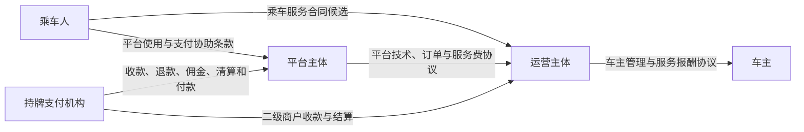
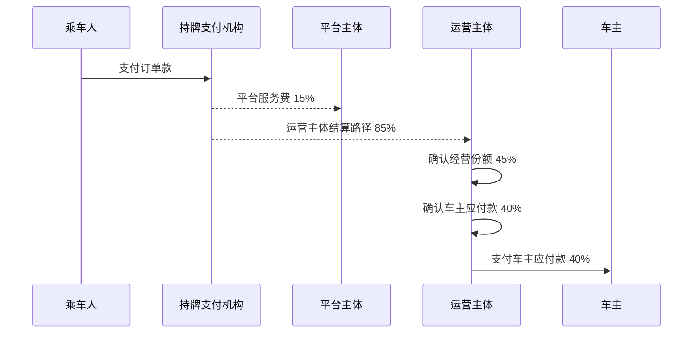

# 服务费与多运营主体分成设计

## 文档状态

`评审中；允许合成模型验证；禁止真实资金生产启用`

本设计展开 `docs/decisions/0014-平台服务费与多运营主体分成.md`，定义平台、运营主体和车主之间的经济权益、资金路径、账本责任、运营系统和对账边界。

本设计使用以下商业比例：

```text
平台服务费：15%
运营主体经营份额：45%
车主应付款：40%
```

比例针对订单可分配金额，不代表未经专业确认的法定收入、税基或发票金额。

普通订单没有路桥费、停车费等代垫项目时，可分配金额等于订单总额，车主应得即为订单总额的 `40%`。存在代垫或依法不得分配的款项时，先剥离该部分，再对可分配车费执行 `15%/45%/40%`。

## 设计原则

1. **服务费与运营分成分离**：平台 `15%` 是平台服务费；运营主体 `45%` 是运营经营份额；车主 `40%` 是运营主体对车主的应付款。
2. **经济权益与会计确认分离**：订单分配子账可以固定为 `15/45/40`，法定会计总额或净额确认必须由会计政策映射。
3. **平台不建立钱包**：平台内部余额只是不可变账本投影，不能充值、转让或自由提现。
4. **车主付款责任明确**：运营主体收到或被确认享有 `85%` 后，车主 `40%` 仍是开放应付款，直到付款成功。
5. **历史订单不可篡改**：运营主体、比例、合同和规则均在接单时快照。
6. **费用不侵蚀约定份额**：支付手续费由平台承担，车主付款手续费由运营主体承担。
7. **先退款、后追偿**：乘车人合法退款不因平台、运营主体和车主之间的追偿失败而长期阻塞。
8. **所有真实能力默认关闭**：本设计不能自行打开 `real_payment`、`real_settlement` 或 `real_withdrawal`。

## 主体模型

### 平台主体

候选主体示例为 `AAA 信息技术公司`，系统使用稳定的 `platform_entity_id`，不得把展示名称作为资金主键。

职责：

- App、Server 和运营后台。
- 订单撮合和交易秩序。
- 统一报价和费用披露。
- 风控、安全、支付协调和对账。
- 运营主体准入、暂停和退出管理。
- 平台服务费开票候选责任。
- 用户支付手续费承担。

### 运营主体

一个平台可以接入多个运营主体：

```text
operator_entity_id
legal_name
unified_social_credit_code
operating_city_codes
merchant_profile_id
settlement_account_reference
tax_profile_reference
contract_version
state
effective_from
effective_to
```

状态：

```text
draft
under_review
active
suspended
exiting
exited
revoked
```

职责：

- 车主合同和日常运营管理。
- 车主与车辆准入协同。
- 车主应付款确认、付款和付款失败处置。
- 付款手续费承担。
- 运营主体账单、税务资料和对账。
- 运营主体名下服务质量和安全案件协作。

### 车主与运营主体关系

```text
driver_operator_membership_id
driver_account_id
operator_entity_id
city_code
vehicle_id
contract_version
state
effective_from
effective_to
```

状态：

```text
pending
active
suspended
terminated
expired
```

约束：

- 同一车主可以保留多个历史关系。
- 同一城市和车辆在同一时刻只能有一个用于接单和结算的有效主运营关系。
- 接单时必须存在有效关系。
- 关系暂停后不得接受新订单。
- 关系变化不修改历史订单。

## 合同关系内部候选



该图是内部候选，不构成法律结论。若法律意见认定平台是网络预约出租汽车经营者、承运人或乘车服务主要责任人，必须按法定义务重构合同和会计映射，不能仅通过运营主体名称转移责任。

## 订单金额模型

### 金额组成

```text
gross_order_amount_minor
passenger_payment_minor
platform_subsidy_minor
operator_subsidy_minor
pass_through_expense_minor
allocable_fare_minor
refundable_amount_minor
```

关系：

```text
allocable_fare_minor
= passenger_payment_minor
+ platform_subsidy_minor
+ operator_subsidy_minor
- pass_through_expense_minor
- non_allocable_amount_minor
```

实际公式必须由报价规则版本生成，禁止后台手工拼接。

### 进入分成基数

- 基础车费。
- 里程费用。
- 时长费用。
- 预约费用。
- 已批准的车型或时段调整。

### 不进入分成基数

- 路桥和停车等代垫费用。
- 押金和预授权金额。
- 支付机构手续费。
- 车主付款手续费。
- 未批准的取消费、违约金和赔偿。
- 明确应全额归还某一承担方的费用。

## 分配算法

### 基点

```text
platform_rate_bps = 1500
operator_rate_bps = 4500
driver_rate_bps = 4000
```

### 整数算法

```text
platform_share_minor = floor(allocable_fare_minor * 1500 / 10000)
operator_share_minor = floor(allocable_fare_minor * 4500 / 10000)
driver_share_minor = allocable_fare_minor
  - platform_share_minor
  - operator_share_minor
```

不变量：

```text
platform_share_minor >= 0
operator_share_minor >= 0
driver_share_minor >= 0
platform_share_minor + operator_share_minor + driver_share_minor
  = allocable_fare_minor
```

尾差进入车主份额，防止平台或运营主体通过小额舍入积累隐藏收益。

### 示例

| 可分配金额 | 平台 | 运营主体 | 车主 | 校验 |
| ---: | ---: | ---: | ---: | --- |
| `100.00` | `15.00` | `45.00` | `40.00` | `100.00` |
| `99.99` | `14.99` | `44.99` | `40.01` | `99.99` |
| `0.01` | `0.00` | `0.00` | `0.01` | `0.01` |

## 订单分配快照

`OrderRevenueShareSnapshot`：

```text
order_revenue_share_snapshot_id
trip_id
payment_order_id
platform_entity_id
operator_entity_id
driver_account_id
driver_operator_membership_id
revenue_share_policy_id
revenue_share_rule_version
platform_rate_bps
operator_rate_bps
driver_rate_bps
allocable_fare_minor
platform_share_minor
operator_share_minor
driver_share_minor
currency
platform_contract_version
operator_contract_version
driver_contract_version
created_at
```

创建时机：

- 报价时可以生成预览，但不形成最终权益。
- 车主接受订单时锁定主体、比例和合同。
- 行程完成或最终责任确定时，依据最终可分配金额生成权威分配。
- 若最终金额变化，生成新版本并冲正旧版本，不覆盖旧记录。

## 外部资金路径

### 推荐路径



真实支付机构可能先冻结、后分账，或先进入二级商户账户再分佣。系统不得把某一供应商资金时序硬编码为领域规则。

### 支付机构能力结论

| 产品 | 公开能力结论 | 对本模型的影响 |
| --- | --- | --- |
| 微信支付普通商户分账 | 默认最高分账比例 `30%`，可分给商户或个人 | 不能默认直接分出运营主体 `45%` 或车主 `40%` |
| 微信支付服务商分账 | 服务商可帮助特约商户分账，公开默认上限仍为 `30%` | 平台 `15%` 候选可行，三方全拆分不可直接假设 |
| 微信支付平台收付通 | 支持二级商户、平台佣金、分账、补差、退款、余额、提现和账单 | 最符合多运营主体的当前候选 |
| 支付宝商家分账 | 资金先到商家账户，最高分出 `30%`，接收方可为企业或个人 | 不能默认直接分出 `45%` 或 `40%` |
| 支付宝退分账 | 接收方需授权；个人接收方不支持分账回退 | 首期不应直接向个人车主分账 |

公开文档不等于商务准入，必须以支付机构针对具体行业、主体和交易模型的书面方案为准。

## 手续费

### 用户支付手续费

归属：

- 由平台承担。
- 记入平台支付手续费费用。
- 不减少 `operator_share_minor`。
- 不减少 `driver_share_minor`。

支付机构在清算时直接扣除手续费的，账本仍需按毛额确认平台服务费和单独费用，不能只记录净到账。

### 车主付款手续费

归属：

- 由运营主体承担。
- 记入运营主体付款手续费费用。
- 车主应付款保持完整。

若供应商从车主到账金额中直接扣费，运营主体必须补足差额或使用确保车主足额到账的付款产品。

### 税款

- `15%/45%/40%` 是各方税前经济权益。
- 法定代扣代缴不改变毛权益，只改变现金付款和税费应付款。
- 所有扣税必须在车主结算单中单独显示税种、计税依据、税额和凭证引用。
- 不得把税款命名为平台服务费、运营管理费或提现手续费。

## 优惠、补差和代垫

### 平台优惠

示例：原可分配金额 `100.00 元`，乘车人支付 `90.00 元`，平台优惠 `10.00 元`。

```text
passenger_payment_minor = 9000
platform_subsidy_minor = 1000
allocable_fare_minor = 10000
```

分配仍为 `15.00/45.00/40.00`。平台另记 `10.00 元` 营销费用或补差责任。

### 运营主体优惠

运营主体优惠不得减少车主 `40%`。运营主体从自身 `45%` 或独立营销费用承担。

### 代垫费用

路桥、停车等费用应包含：

```text
expense_type
amount_minor
advanced_by
evidence_reference
reimbursement_recipient
```

代垫金额全额归实际承担方，不参与比例分配。

## 生命周期和状态机

### 分配单

`RevenueAllocationOrder`：

```text
created
blocked
ready
posted
partially_reversed
reversed
```

阻断条件：

- 行程未完成或责任未确定。
- 支付未最终成功。
- 存在退款、拒付、安全冻结或金额差异。
- 运营主体关系无效。
- 快照比例之和不等于 `10000`。

### 运营主体清算

`OperatorSettlementOrder`：

```text
created
processing
unknown
succeeded
failed
reversed
```

### 车主付款

`DriverPayoutOrder`：

```text
created
blocked
processing
unknown
succeeded
failed
reversed
manual_review
```

车主付款成功必须来自已验签回调或主动查询，不得依赖 App 或运营人员手工标记。

## 复式账本

### 分配子账科目

| 科目代码 | 科目名称 | 类别 | 维度 |
| --- | --- | --- | --- |
| `LIABILITY_OPERATOR_ENTITLEMENT` | 运营主体经营份额应付款 | 负债 | 运营主体、行程 |
| `LIABILITY_DRIVER_PAYABLE` | 车主应付款 | 负债 | 运营主体、车主、行程 |
| `LIABILITY_PAYOUT_CLEARING` | 付款清算中间负债 | 负债 | 运营主体、付款单 |
| `REVENUE_PLATFORM_SERVICE` | 平台服务费收入 | 收入 | 平台、产品、城市 |
| `EXPENSE_PROVIDER_FEE` | 用户支付手续费 | 费用 | 平台、支付机构 |
| `EXPENSE_OPERATOR_PAYOUT_FEE` | 车主付款手续费 | 费用 | 运营主体、付款机构 |
| `LIABILITY_WITHHOLDING_TAX` | 代扣代缴税费 | 负债 | 运营主体、车主、税种 |

### 行程完成分配

订单可分配金额 `100.00 元`：

| 借贷 | 科目 | 金额 |
| --- | --- | ---: |
| 借 | 乘车人待履约资金 | `100.00` |
| 贷 | 平台服务费收入 | `15.00` |
| 贷 | 运营主体经营份额应付款 | `45.00` |
| 贷 | 车主应付款 | `40.00` |

### 外部清算到运营主体

支付机构向运营主体对应结算路径清算 `85.00 元`，只表示资金进入运营主体控制范围，不表示车主已经收款。

系统必须：

- 关闭运营主体 `45.00 元` 经营份额的外部清算责任。
- 将车主 `40.00 元` 应付款的义务主体保持为运营主体。
- 生成运营主体资金到账和车主应付款账龄记录。

不同法律实体的法定总账不得直接用一套合并分录替代。平台分配子账、运营主体分配子账和各主体法定总账之间使用可追溯映射。

### 车主付款

向车主付款 `40.00 元`：

| 借贷 | 科目 | 金额 |
| --- | --- | ---: |
| 借 | 车主应付款 | `40.00` |
| 贷 | 付款清算中间负债 | `40.00` |

支付机构确认到账后：

| 借贷 | 科目 | 金额 |
| --- | --- | ---: |
| 借 | 付款清算中间负债 | `40.00` |
| 贷 | 运营主体银行资金或支付机构结算资产 | `40.00` |

付款手续费 `0.10 元`：

| 借贷 | 科目 | 金额 |
| --- | --- | ---: |
| 借 | 车主付款手续费 | `0.10` |
| 贷 | 运营主体银行资金或支付机构应付 | `0.10` |

## 会计映射

订单分配子账固定表达经济权益，但法定会计至少存在两种候选：

### 候选一：运营主体是乘车服务主要责任人

- 平台按净额确认 `15%` 平台服务收入。
- 运营主体可能按总额确认 `85%` 乘车服务收入。
- 车主 `40%` 可能记为运营主体服务成本和车主应付款。

### 候选二：运营主体也是代理人

- 平台按 `15%` 确认服务收入。
- 运营主体按净额确认 `45%` 运营服务收入。
- 车主按 `40%` 确认其服务所得。

采用哪一种必须由正式会计政策根据合同控制、定价权、主要履约责任、信用风险和代理关系决定。工程系统必须支持两种导出映射，不能在没有会计意见时把经济分配直接写死为法定收入。

## 发票和税务候选

内部候选：

1. 运营主体向乘车人提供乘车服务发票或依法适用的票据。
2. 平台向运营主体就 `15%` 平台服务费开具发票。
3. 车主向运营主体提供服务凭证，或由运营主体依法代办税务、代扣代缴和生成结算凭证。

未决风险：

- 若平台被认定为乘车服务主要责任人，乘车人发票和收入确认可能需要改由平台承担。
- 车主与运营主体属于劳动、劳务、承揽、合作经营或其他关系，将影响付款、社保、个税和凭证。
- `15%/45%/40%` 是否按含税成交价计算需要税务意见。

工程候选统一按含税可分配金额计算经济权益；各方份额包含其依法承担的税负，不额外改变总额守恒。

## 退款和逆向分配

### 分配前

```text
乘车人待履约资金 -> 退款应付款
```

不产生平台、运营主体或车主收入。

### 分配后、清算前

1. 冲正原分配单。
2. 形成退款应付款。
3. 原分配单保留并关联冲正单。

### 清算到运营主体后

1. 优先发起支付机构退分账、回退或原路退款。
2. 运营主体可用资金不足时建立资金差异和应收案件。
3. 冻结运营主体新订单清算和必要范围的新接单。
4. 不允许使用其他车主无关应付款永久填补差额。

### 已向车主付款后

1. 乘车人退款按法律和责任结论优先执行。
2. 责任追偿作为独立应收，不覆盖原付款记录。
3. 未经合同、授权和法律依据，不得自动从车主未来订单中扣回。
4. 允许扣回时必须设置上限、明细、通知、申诉和双人复核。

### 部分退款

按最终保留的可分配金额重新执行同一规则版本，生成差额冲正：

```text
new_platform_share
new_operator_share
new_driver_share
```

禁止对原三个份额分别独立四舍五入后再猜测差额。

## 拒付、安全冻结和异常

- 拒付不删除原支付、分配和付款记录。
- 未付款的车主应付款可以按关联订单范围冻结。
- 已付款金额进入追偿或坏账流程。
- 安全案件只冻结相关主体、订单或结算批次，不进行无期限全局冻结。
- 支付或付款为 `unknown` 时禁止提交新的同金额资金请求，必须先查询原请求。
- 运营主体失联、注销或账户冻结时，立即停止新订单清算并进入退出案件。

## 运营后台能力

### 平台资金运营

- 查看运营主体准入和商户资料状态。
- 查看订单分配预览和权威分配。
- 查看平台服务费、支付手续费和净贡献。
- 查看运营主体 `85%` 清算状态。
- 查看车主应付款账龄和付款异常。
- 查看退款、退分账、拒付和对账差异。
- 发起受控资金案件，不直接修改余额。

### 运营主体后台

- 查看本主体名下订单和 `45%` 经营份额。
- 查看本主体名下车主 `40%` 应付款。
- 创建付款批次。
- 查看付款手续费和失败原因。
- 下载运营主体结算单和车主结算单。
- 提交收款账户、税务资料和联系人变更申请。
- 不得修改历史分成比例和订单归属。

### 车主端

- 查看逐订单毛应得金额。
- 查看法定税费扣缴和凭证。
- 查看付款状态、预计时间和失败恢复入口。
- 查看当前运营主体和合同版本。
- 不展示可转让或可充值的钱包余额。

## 权限和双人复核

| 操作 | 经办 | 复核 | 约束 |
| --- | --- | --- | --- |
| 新增运营主体 | 平台运营 | 合规或财务 | 企业、商户和合同资料完整 |
| 修改未来分成规则 | 产品或财务经办 | 财务负责人和最终决策人 | 版本化、未来生效 |
| 修改收款账户 | 运营主体管理员 | 平台财务复核 | 强认证和冷静期 |
| 创建车主付款批次 | 运营主体财务 | 运营主体独立复核 | 不得超过开放应付款 |
| 例外退款或追偿 | 财务经办 | 独立财务复核 | 关联责任案件 |
| 冲正账本 | 财务经办 | 财务负责人 | 只追加，不修改原分录 |

开发、客服和普通运营人员不得拥有真实资金执行权限。

## 结算周期

内部候选：

- 平台和运营主体按支付机构实际清算周期接收资金。
- 车主付款采用每日批次，默认在行程完成且无冻结后的下一个结算日发起。
- 周末、节假日、供应商处理时间和未知结果必须显示预计范围，不承诺不可控的精确到账时刻。
- 任何缩短账期的能力不得绕过退款、拒付、安全和对账门禁。

具体 `T+N` 由支付机构合同、银行处理和运营主体资金安排共同批准，不能由前端文案单独决定。

## 对账

### 五段对账

1. 乘车人订单金额与支付机构收款。
2. 可分配金额与 `15%/45%/40%` 分配。
3. 平台 `15%` 与平台实际清算、支付手续费。
4. 运营主体 `85%` 与运营主体实际清算。
5. 车主 `40%` 与车主付款、付款手续费和法定扣缴。

### 控制公式

```text
allocable_fare_minor
= platform_share_minor
+ operator_share_minor
+ driver_share_minor
```

```text
operator_settlement_gross_minor
= operator_share_minor
+ driver_share_minor
- operator_refund_reversal_minor
```

```text
driver_payable_open_minor
= driver_share_minor
- driver_payout_succeeded_minor
- approved_driver_reversal_minor
- lawful_withholding_minor
```

```text
platform_cash_contribution_minor
= platform_share_minor
- provider_payment_fee_minor
- platform_refund_fee_minor
- platform_subsidy_minor
```

任一公式非零差异必须进入案件，不能自动核销。

### 报表

- 平台服务费日报和月报。
- 支付手续费率和实际费用差异。
- 运营主体 `85%` 清算报表。
- 运营主体 `45%` 经营份额报表。
- 车主 `40%` 应付款、已付款和账龄报表。
- 退款、退分账、追偿和坏账报表。
- 运营主体余额不足和付款失败报表。
- 分成规则版本影响报表。

## 数据和审计

必须保留：

- 主体和合同版本。
- 车主运营归属历史。
- 报价、订单和分配快照。
- 每次外部资金请求、响应摘要和查询结果。
- 手续费、税费、退款和冲正。
- 运营主体和车主结算单。
- 权限操作、双人复核和账户变更。

禁止记录：

- 完整银行卡号。
- 支付密码和验证码。
- 商户私钥。
- 可用于重放的完整敏感回调。

## 风险控制

- 运营主体新订单额度可以基于未支付车主应付款、退款欠款和对账差异受控下降。
- 风险额度不是平台收入，不得形成隐性保证金或储值。
- 不得跨运营主体挪用资金。
- 不得用新订单资金长期填补旧订单车主应付款。
- 不得允许运营主体对单个车主设置歧视性分成。
- 不得因车主性别、头像或乘车人偏好改变分成、账期和费用。

## 验收矩阵

| 场景 | 必须结果 |
| --- | --- |
| `100.00 元` 正常订单 | 分配为 `15.00/45.00/40.00` |
| `99.99 元` 尾差 | 分配为 `14.99/44.99/40.01` |
| 平台支付手续费 | 只减少平台手续费后贡献 |
| 运营主体付款手续费 | 只减少运营主体手续费后贡献 |
| 平台优惠 | 运营主体和车主按原基数获得份额 |
| 路桥费 | 全额归实际承担方，不参与分成 |
| 车主更换运营主体 | 历史订单快照不变 |
| 运营主体暂停 | 不再承接新订单，历史应付款继续处理 |
| 分配后全额退款 | 原分配全部冲正并形成退款 |
| 车主已付款后退款 | 先退款，后独立追偿 |
| 付款未知 | 查询原付款，不创建重复付款 |
| 个人接收方无法退分账 | 阻止采用该直接分账路径 |
| 比例后台被篡改 | 请求被拒绝并产生安全审计 |
| 对账差异非零 | 阻止结算、付款或关账 |

## 生产停止线

以下任一项未完成时，真实资金保持关闭：

- 平台与运营主体的运输经营和消费者责任书面意见。
- 平台、运营主体和车主会计及税务书面方案。
- 乘车服务发票和平台服务费发票路径。
- 支付机构针对具体主体的产品准入和完整资金流程确认。
- 运营主体商户进件、收款账户和付款能力验证。
- 退款、退分账、余额不足和运营主体退出演练。
- 生产商户号、密钥、权限、轮换和应急机制。
- 五段对账和复式账本完整验证。

## 外部参考

- 微信支付普通商户分账产品介绍：`https://pay.weixin.qq.com/doc/v3/merchant/4012067962`
- 微信支付服务商分账产品介绍：`https://pay.weixin.qq.com/doc/v3/partner/4012072582`
- 微信支付平台收付通产品介绍：`https://pay.weixin.qq.com/doc/v3/partner/4012086891`
- 支付宝 APP 支付产品介绍：`https://opendocs.alipay.com/open/204/105051`
- 支付宝商家分账产品介绍：`https://opendocs.alipay.com/open/repo-0038ln`

## 下一步

1. 完成法律、财务和税务专项书面评审。
2. 让微信支付和支付宝分别提供针对多运营主体模型的书面产品方案。
3. 多运营主体入驻、车主主运营关系、合成清算、车主付款和退出流程以 `docs/finance/05-多运营主体管理与结算系统设计.md` 为详细设计事实源。
4. 在设计评审通过后，再决定是否把机器契约和实现任务写入 `ROADMAP.md`。
