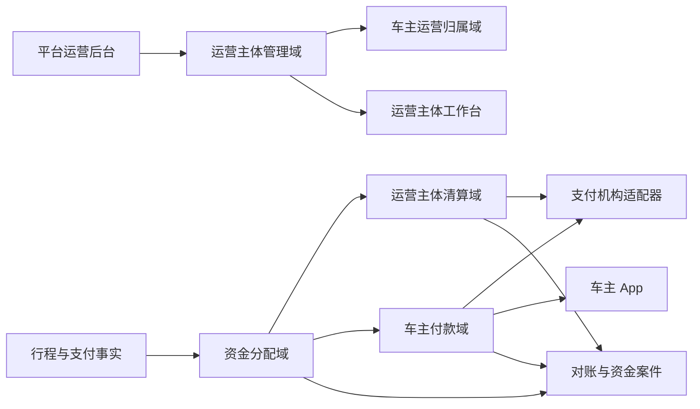
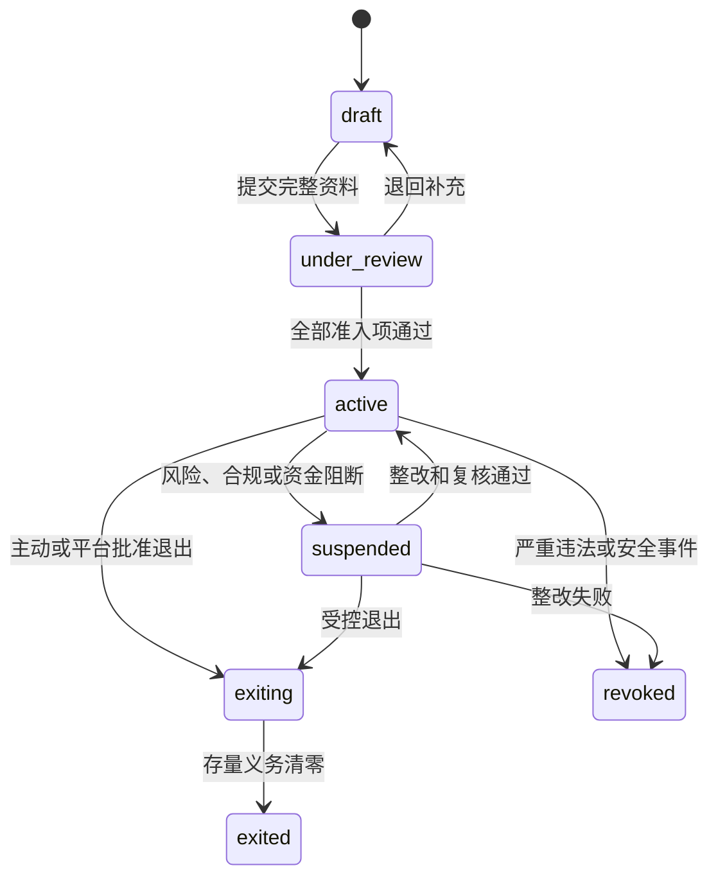
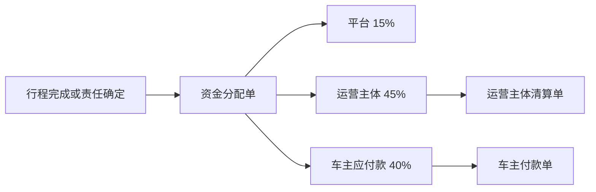

# 多运营主体管理与结算系统设计

## 文档状态

`有条件通过设计评审；允许继续机器契约准备和合成验证；禁止真实资金生产启用`

本设计展开：

- `docs/decisions/0014-平台服务费与多运营主体分成.md`
- `docs/finance/04-服务费与多运营主体分成设计.md`

唯一经济分配口径：

```text
平台服务费：15%
运营主体经营份额：45%
车主应付款：40%
```

普通订单不存在路桥费、停车费等代垫项目时，车主获得订单总额的 `40%`。存在代垫或依法不得参与分配的款项时，先剥离该部分，再对可分配车费执行 `15%/45%/40%`。

## 设计目标

- 支持一个平台主体管理多个运营主体。
- 让每个车主在接单时具有唯一、有效、可追溯的主运营关系。
- 将运营主体入驻、暂停、退出和车主迁移变成明确状态流。
- 将资金分配、运营主体清算和车主付款拆成三个独立过程。
- 支持每日结算、双人复核、批量付款、部分成功、未知结果和失败恢复。
- 确保运营主体收到 `85%` 后，车主 `40%` 仍保持为开放应付款，直到付款成功。
- 为平台后台、运营主体工作台和车主 App 提供明确页面与任务结构。
- 在不建立平台钱包、不接真实资金的前提下允许合成实现和验收。

## 非目标

- 不批准真实商户号、银行账户、分账、付款和提现。
- 不建立平台储值钱包、运营主体钱包或车主可转让余额。
- 不允许运营主体自定义 `45%/40%` 比例。
- 不在本设计中最终确定运输经营、劳动关系、税率和发票主体。
- 不允许以“运营主体”结构规避平台依法应承担的安全、承运、消费者保护或监管责任。
- 不为运营主体提供贷款、垫资、保理或融资能力。

## 统一领域语言

| 术语 | 定义 | 禁止混用 |
| --- | --- | --- |
| 运营主体 | 与平台签约并负责其名下车主运营管理、付款和结算资料的企业主体 | 车队、代理商、渠道商 |
| 主运营关系 | 车主、城市和车辆在一个有效期内唯一用于接单和结算的运营主体归属 | 临时归属、默认车队 |
| 资金分配单 | 确认平台 `15%`、运营主体 `45%`、车主 `40%` 经济权益 | 结算单、分账结果 |
| 运营主体清算单 | 记录运营主体对应 `85%` 外部资金清算 | 车主已付款 |
| 车主付款单 | 运营主体向车主已验证账户支付 `40%` 应付款 | 提现单 |
| 车主付款批次 | 一个运营主体按结算日聚合的付款执行单元 | 钱包提现批次 |
| 运营主体结算单 | 面向运营主体的不可变期间报表 | 可修改 Excel |
| 车主结算单 | 面向车主的不可变期间报表 | 余额账单 |
| 资金案件 | 金额、退款、付款、账户或退出异常的受控调查记录 | 客服备注 |

## 系统边界



### 平台负责

- 运营主体企业准入和状态管理。
- 车主主运营关系规则。
- 订单和分成规则的 Server 权威计算。
- 平台 `15%`、运营主体 `45%`、车主 `40%` 分配子账。
- 支付机构适配器、账单导入和五段对账。
- 运营主体清算、车主付款、退款和异常的全局可观察性。
- 高风险账户变更、权限和资金案件复核。

### 运营主体负责

- 其名下车主邀请、合同和运营管理。
- 车主收款资料协同和异常跟进。
- 车主付款批次的经办与独立复核。
- 车主付款手续费。
- 运营主体结算单、车主结算单和税务资料。
- 退款追偿、付款失败和退出清算协作。

### 车主负责

- 接受明确的主运营关系和合同版本。
- 维护本人已验证收款账户。
- 查看逐订单 `40%` 毛应得、法定扣缴和付款状态。
- 对归属、金额和付款结果提出申诉。

## 运营主体聚合

### 运营主体实体（`OperatorEntity`）

```text
operator_entity_id
legal_name
display_name
unified_social_credit_code
legal_representative_reference
registered_address
operating_city_codes
contract_version
merchant_profile_id
tax_profile_reference
settlement_account_reference
security_contact_reference
finance_contact_reference
state
restriction_reason_code
effective_from
effective_to
version
created_at
updated_at
```

### 主状态

```text
draft
under_review
active
suspended
exiting
exited
revoked
```

含义：

| 状态 | 新增车主 | 接受新订单 | 处理存量行程 | 清算和车主付款 |
| --- | --- | --- | --- | --- |
| `draft` | 否 | 否 | 无 | 否 |
| `under_review` | 否 | 否 | 无 | 仅测试 |
| `active` | 是 | 是 | 是 | 是 |
| `suspended` | 否 | 否 | 是，按安全规则 | 只允许退款、车主付款和差异处理 |
| `exiting` | 否 | 否 | 是 | 必须完成存量清算 |
| `exited` | 否 | 否 | 否 | 只读查询和未结案件处理 |
| `revoked` | 否 | 否 | 按安全处置 | 只允许退款、追偿和监管要求动作 |

### 状态机



`revoked` 不是删除。历史订单、账本、合同、付款和审计记录必须保留。

## 运营主体入驻

### 入驻案件

`OperatorOnboardingCase`：

```text
operator_onboarding_case_id
operator_entity_id
submitted_by
state
legal_review_state
business_review_state
finance_review_state
payment_onboarding_state
security_review_state
contract_signing_state
blocking_reasons
submitted_at
approved_at
rejected_at
```

状态：

```text
draft
submitted
reviewing
changes_requested
approved
rejected
expired
```

### 必要资料

#### 企业和经营

- 企业名称和统一社会信用代码。
- 法定代表人或授权负责人。
- 注册地址和实际运营地址。
- 拟运营城市。
- 经营资质和保险材料引用。
- 平台、运营主体、车主之间的合同版本。

#### 支付和财务

- 支付机构商户进件状态。
- 收款账户验证结果。
- 车主付款产品能力。
- 发票和税务资料。
- 财务经办、复核和负责人。

#### 安全和运营

- 安全联系人。
- 投诉和案件响应联系人。
- 数据访问负责人。
- 账户权限清单。
- 退出和应急预案。

### 审核原则

- 经办人不能批准自己提交的资料。
- 企业身份、收款账户和合同任一项未通过，不得进入 `active`。
- 资料过期自动回到 `changes_requested` 或 `suspended`，不得静默继续运营。
- 外部证据只保存受控引用和摘要，不在仓库或普通日志保存完整敏感材料。

## 运营主体能力档案

`OperatorCapabilityProfile`：

```text
operator_entity_id
driver_onboarding_enabled
trip_acceptance_enabled
operator_settlement_enabled
driver_payout_enabled
driver_early_settlement_enabled
refund_cooperation_enabled
maximum_active_drivers
maximum_daily_orders
maximum_open_driver_payable_minor
maximum_unresolved_difference_minor
capability_version
effective_from
```

规则：

- 能力档案控制运营范围，不改变 `15%/45%/40%`。
- 额度变化只影响未来订单。
- 资金差异、车主应付款逾期或支付机构异常可以降低接单额度。
- 额度不是保证金、授信或平台资金账户。
- 自动规则可以提出限制建议；长期暂停或撤销必须由授权人员复核，紧急安全冻结除外。

## 车主主运营关系

### 车主运营关系（`DriverOperatorMembership`）

```text
driver_operator_membership_id
driver_account_id
operator_entity_id
city_code
vehicle_id
contract_version
state
effective_from
effective_to
accepted_by_driver_at
approved_by_operator_at
suspension_reason_code
termination_reason_code
version
```

状态：

```text
pending
active
suspended
terminated
expired
```

### 不变量

- 同一车主、城市和车辆的有效主运营关系不得重叠。
- 只有 `active` 关系允许接受新订单。
- 订单接受时必须快照 `driver_operator_membership_id`。
- 关系暂停不修改已经接受订单的运营主体。
- 历史车主应付款始终由订单快照中的运营主体负责。
- 运营主体不能通过解除关系消灭车主应付款。

### 新增关系流程

1. 运营主体邀请车主，或车主申请加入运营主体。
2. 系统核验车主身份、车辆、城市和现有主运营关系。
3. 展示运营主体、合同版本和 `40%` 车主分配口径。
4. 车主确认关系。
5. 运营主体确认接纳。
6. 生效时间到达后进入 `active`。

正常流程不得由平台运营人员代替车主确认合同。

### 运营主体迁移

迁移使用 `DriverOperatorTransferCase`：

```text
transfer_case_id
driver_account_id
from_operator_entity_id
to_operator_entity_id
city_code
vehicle_id
requested_effective_at
state
blocking_open_trip_count
blocking_financial_case_count
created_at
completed_at
```

状态：

```text
requested
validating
awaiting_driver_confirmation
scheduled
blocked
completed
cancelled
```

切换规则：

- 生效前旧关系继续负责新接订单。
- 双方确认、系统校验完成且不存在进行中行程后，默认在下一个自然日 `00:00` 生效。
- 到达切换时间后，旧关系停止接受新订单，新关系开始生效。
- 切换时间前已经接受的订单继续归旧运营主体。
- 旧订单形成的运营主体清算、车主应付款、退款和追偿继续由旧运营主体承担。
- 禁止通过迁移把未付款订单批量转给新运营主体。
- 存在进行中行程时可以推迟切换，但不得修改该行程快照。

## 订单资金快照

车主接受订单时锁定：

```text
platform_entity_id
operator_entity_id
driver_account_id
driver_operator_membership_id
platform_rate_bps = 1500
operator_rate_bps = 4500
driver_rate_bps = 4000
revenue_share_rule_version
platform_contract_version
operator_contract_version
driver_contract_version
accepted_at
```

运营主体状态、合同和关系随后变化，不修改历史订单。

## 三段资金过程



### 第一段：资金分配

条件：

- 支付最终成功。
- 行程完成或责任最终确定。
- 最终可分配金额已锁定。
- 无金额不一致。
- 分成规则版本有效且总和为 `10000` 基点。

结果：

- 平台 `15%`。
- 运营主体 `45%`。
- 车主应付款 `40%`。
- 生成不可变资金分配单。

### 第二段：运营主体清算

运营主体清算金额：

```text
operator_settlement_gross_minor
= operator_share_minor
+ driver_share_minor
- operator_refund_reversal_minor
```

正常订单为 `85%`。

运营主体清算成功只证明资金进入运营主体受控商户或结算路径，不证明车主已经收款。

### 第三段：车主付款

车主毛应付款：

```text
driver_gross_payable_minor = driver_share_minor
```

车主净付款：

```text
driver_net_payout_minor
= driver_gross_payable_minor
- lawful_withholding_minor
- approved_reversal_minor
```

车主付款手续费不进入该公式，由运营主体另行承担。

## 结算日历

### 账务日

- 统一时区：`Asia/Shanghai`。
- 账务日按自然日定义。
- 行程完成时间决定初始结算日。
- 跨日退款、拒付和冲正进入发生日，但必须引用原订单和原分配单。

### 合成环境默认周期

- 每日生成上一账务日的运营主体清算候选。
- 每日生成上一账务日的车主付款候选。
- 只有对账、冻结和账户校验通过的项目进入批次。
- 合成时钟可以推动批次，但不得出现在普通用户主流程。

### 内部候选结算周期

- `T` 定义为支付成功、行程责任最终确定、资金分配已入账且所有冻结解除的账务日，不简单等同于行程完成日。
- 标准车主付款日为下一个可处理结算日，即 `T+1`。
- 系统必须在付款日 `12:00` 前生成车主付款批次，并在 `18:00` 前完成复核和提交。
- 已在 `18:00` 前提交支付机构但仍处于 `processing` 或 `unknown` 的付款不算运营主体内部逾期，但必须持续查询和通知。
- 因运营主体未复核、资金不足、账户无效或内部操作导致未在 `18:00` 前提交的，进入逾期。
- 周末和法定节假日是否可处理由支付机构和收款渠道日历决定；不支持时顺延到下一个可处理结算日。

真实环境的精确执行窗口可以根据支付机构合同调整，但不得晚于用户协议、运营主体合同和车主合同中披露的时限。

## 运营主体清算批次

### 运营主体清算批次（`OperatorSettlementBatch`）

```text
operator_settlement_batch_id
operator_entity_id
business_date
currency
merchant_profile_id
state
item_count
gross_amount_minor
refund_reversal_minor
net_amount_minor
provider_batch_id
idempotency_key
created_at
submitted_at
completed_at
```

状态：

```text
draft
calculating
validation_failed
ready
submitting
processing
partially_succeeded
succeeded
failed
unknown
reversed
```

### 入批条件

- 资金分配单已 `posted`。
- 运营主体和订单快照一致。
- 支付机构收款事实已对账。
- 无退款、拒付、安全冻结或金额差异。
- 商户和结算账户状态有效。
- 同一分配项未进入其他有效批次。

### 批次控制

- 同一运营主体、账务日、币种和批次版本只能有一个有效批次。
- 批次金额只能由 Server 汇总，运营人员不能输入。
- 重试必须复用原幂等键。
- `unknown` 状态必须查询原批次，不能新建替代批次。
- 部分成功按清算项分别落账，失败项保留原引用重试。

## 车主付款批次

### 车主付款批次（`DriverPayoutBatch`）

```text
driver_payout_batch_id
operator_entity_id
business_date
currency
payout_account_profile_id
state
item_count
gross_payable_minor
withholding_minor
net_payout_minor
payout_fee_minor
prepared_by
reviewed_by
approved_at
provider_batch_id
idempotency_key
created_at
submitted_at
completed_at
```

状态：

```text
draft
calculating
validation_failed
awaiting_review
approved
submitting
processing
partially_succeeded
succeeded
failed
unknown
cancelled
```

### 车主付款项（`DriverPayoutItem`）

```text
driver_payout_item_id
driver_payout_batch_id
driver_account_id
operator_entity_id
driver_payment_account_reference
source_allocation_ids
gross_payable_minor
withholding_minor
net_payout_minor
state
provider_payout_id
failure_code
created_at
completed_at
```

状态：

```text
pending
blocked
submitting
processing
succeeded
failed
unknown
reversed
manual_review
```

### 入批条件

- 车主应付款已经确认。
- 对应运营主体清算事实满足合同要求。
- 车主收款账户已验证且未变更冷静期。
- 无退款、拒付、安全冻结、申诉或金额差异。
- 法定扣缴规则和凭证已生成。
- 同一车主应付款未进入其他有效付款单。

### 双人复核

- 经办人生成批次。
- 系统执行金额和账户校验。
- 独立复核人确认批次摘要。
- 经办人和复核人不得为同一账户、同一会话或共享凭据。
- 批准后任何金额或付款账户变化会使批准失效，必须重新复核。
- 超过批准有效期未提交的批次自动回到 `awaiting_review`。

### 手续费

- 车主付款手续费由运营主体承担。
- 批次必须同时记录车主净付款和运营主体手续费。
- 若供应商从车主到账金额中扣除手续费，该付款产品不满足要求，或运营主体必须自动补足差额。

### 提前结算申请

为承接车主端历史“提现”需求，产品提供可选的“提前结算申请”，但不建立车主钱包。

`DriverEarlySettlementRequest`：

```text
driver_early_settlement_request_id
driver_account_id
operator_entity_id
eligible_payable_ids
gross_payable_minor
state
requested_at
reserved_until
driver_payout_batch_id
rejection_reason_code
```

状态：

```text
requested
validating
reserved
batched
rejected
cancelled
expired
```

规则：

- 仅允许申请已经完成、已分配且无冻结的车主应付款。
- 已进入其他付款批次的应付款不能重复申请。
- 申请成功后对应应付款进入短期保留状态，防止定时批次重复入账。
- 超过保留期限仍未入批，自动释放并回到正常付款候选。
- 提前结算不能改变车主 `40%` 毛应得。
- 付款手续费仍由运营主体承担。
- 真实能力默认关闭，只有运营主体、支付产品、税务和风险规则批准后才能启用。
- 生产默认门禁为 `driver_early_settlement_enabled: false`。
- App 使用“申请结算”或“转入收款账户”，不展示平台钱包余额。

## 收款账户管理

### 运营主体账户变更

`OperatorSettlementAccountChange`：

```text
change_request_id
operator_entity_id
old_account_reference
new_account_reference
requested_by
state
cooling_off_until
reviewed_by
verified_at
effective_at
```

状态：

```text
requested
verifying
cooling_off
approved
effective
rejected
cancelled
```

规则：

- 需要强认证和独立复核。
- 默认冷静期为 `48 小时`。
- 冷静期内旧账户保持有效或暂停清算，不能静默切换。
- 旧账户和新账户的企业联系人均收到变更通知。
- 变更生效前必须完成支付机构账户一致性验证。
- 变更不会修改历史清算记录。
- 怀疑旧账户被盗用时不走普通切换流程，立即冻结清算并进入资金案件。

### 车主收款账户变更

- 由车主本人在受信设备发起。
- 需要重新认证和供应商账户验证。
- 默认冷静期为 `24 小时`。
- 冷静期内暂停新付款，但不消灭车主应付款。
- 已提交支付机构的付款单不能改写收款账户。
- 账户变更后历史付款记录保持原掩码和供应商引用。

## 退款、冲正和追偿

### 车主付款前退款

1. 阻止相关付款项入批。
2. 冲正原资金分配。
3. 形成乘车人退款应付款。
4. 更新运营主体清算候选。

### 运营主体已清算、车主未付款

1. 优先使用支付机构退分账或回退。
2. 减少运营主体可清算金额。
3. 冲正运营主体 `45%` 和车主 `40%`。
4. 若运营主体资金不足，创建资金案件并限制新订单能力。

### 车主已经付款

1. 乘车人合法退款优先处理。
2. 保留原车主付款记录。
3. 根据责任和合同创建独立追偿应收。
4. 未经合法授权不得自动从未来订单中扣回。
5. 允许扣回时必须逐项展示、设置上限并提供申诉。

### 追偿不是负余额

平台和运营主体不得在车主 App 中展示可自由变化的“负余额”。追偿应使用独立案件、应收金额、责任依据、处理状态和申诉入口。

## 付款失败和未知结果

### 明确失败

- 记录标准失败码。
- 不关闭车主应付款。
- 修复账户或供应商问题后，可以使用新的付款单重试。
- 新付款单必须引用原失败付款单和相同应付款来源。

### 未知结果

- 不得创建新的相同付款。
- 通过支付机构查询原请求。
- 查询仍未知时进入资金案件。
- 超过恢复时限后由财务运营跟进，但不能手工标记成功。

### 部分成功

- 成功项关闭对应车主应付款。
- 失败和未知项继续开放。
- 批次状态为 `partially_succeeded`。
- 不得为了让批次“整齐”而回滚已经确认成功的付款。

## 运营主体资金风险

### 风险暴露指标

```text
open_driver_payable_minor
overdue_driver_payable_minor
unresolved_refund_minor
unresolved_reconciliation_difference_minor
unknown_payout_minor
chargeback_exposure_minor
```

### 分级处置

| 等级 | 示例 | 默认动作 |
| --- | --- | --- |
| 提醒 | 任一车主付款未在约定付款日提交 | 通知运营主体财务和平台资金运营 |
| 限制 | 逾期超过 `1` 个可处理结算日 | 停止新增车主、关闭提前结算并降低新订单额度 |
| 暂停 | 逾期超过 `2` 个可处理结算日，或确认资金不足、账户冻结 | 停止接受新订单 |
| 撤销 | 挪用资金、拒绝整改或严重违法 | 撤销运营资格并进入退出清算 |

金额阈值可以作为更严格的补充规则配置，但不能放宽上述时间阈值。恢复 `active` 前必须清理全部逾期、完成对账并由平台财务和运营双人复核。

### 风险准备边界

- 当前不建立平台风险准备金、运营主体保证金或跨主体资金池。
- 平台默认不为运营主体垫付车主应付款。
- 支付机构依法提供的冻结、分账和退款回退能力可以使用，但必须按订单和运营主体隔离。
- 若未来需要保证金、保险、保函或平台垫付，必须另行完成法律、财务、支付和资金安全决策。

### 禁止行为

- 跨运营主体挪用资金。
- 使用新订单资金长期填补旧车主应付款。
- 修改历史分配比例。
- 删除失败付款或退款记录。
- 用客服备注替代资金案件。
- 将平台风险额度表达为运营主体可借款额度。

## 运营主体退出

### 退出案件

`OperatorExitCase`：

```text
operator_exit_case_id
operator_entity_id
reason_code
state
new_trip_cutoff_at
active_trip_count
open_driver_payable_minor
open_refund_minor
open_financial_case_count
data_export_state
access_revocation_state
created_at
completed_at
```

状态：

```text
requested
planned
new_business_stopped
settling_open_obligations
awaiting_external_confirmation
completed
blocked
revoked
```

### 退出顺序

1. 自愿退出默认至少提前 `30 个自然日` 提交申请；严重风险或监管要求可以立即进入撤销流程。
2. 停止新增车主和新订单。
3. 完成或安全退出进行中行程。
4. 冻结运营主体资料和账户变更。
5. 完成乘车人退款。
6. 完成车主应付款。
7. 关闭对账差异、拒付和资金案件。
8. 撤销运营主体用户访问权限。
9. 生成最终结算单和数据导出摘要。
10. 状态进入 `exited`。

未清零的车主应付款、退款和资金案件会阻止正常退出。严重违法导致 `revoked` 时仍必须继续处理乘车人和车主合法权益。

## 平台运营后台

### 页面结构

| 页面 | 首要任务 | 不允许的操作 |
| --- | --- | --- |
| 运营主体列表 | 查看状态、城市、风险和待办 | 直接改余额 |
| 运营主体入驻详情 | 审核企业、合同、支付和安全资料 | 单人完成全部审批 |
| 运营主体概览 | 查看车主、订单、清算和风险摘要 | 修改历史比例 |
| 车主归属管理 | 查看、暂停和迁移主运营关系 | 覆盖历史订单归属 |
| 订单资金分配 | 查看 `15%/45%/40%` 和规则版本 | 输入权威金额 |
| 运营主体清算批次 | 查看清算候选、状态和差异 | 手工标记成功 |
| 车主付款观察 | 查看付款批次、失败和账龄 | 代替运营主体任意付款 |
| 退款与追偿 | 查看退款、回退和责任案件 | 无复核扣回 |
| 账户变更 | 复核运营主体收款账户 | 绕过冷静期 |
| 资金案件 | 调查未知、差异、拒付和退出 | 删除流水 |
| 审计记录 | 查询高风险操作 | 修改审计记录 |

### 首页指标

- 活跃运营主体数量。
- 暂停和退出中的运营主体数量。
- 今日可分配金额。
- 平台 `15%` 服务费。
- 运营主体 `45%` 经营份额。
- 车主 `40%` 开放应付款。
- 逾期车主应付款。
- 退款和对账差异金额。
- 未知付款数量和金额。
- 待双人复核任务。

## 运营主体工作台

### 导航

```text
概览
车主
行程与分配
清算
车主付款
退款与案件
结算单
企业与账户
成员与权限
审计
```

### 概览

- 当前运营状态和能力限制。
- 今日订单和可分配金额。
- 运营主体 `45%`。
- 车主 `40%` 开放应付款。
- 今日待复核付款批次。
- 付款失败、退款和对账差异。
- 资质、合同和账户即将到期提醒。

### 车主

- 车主主运营关系列表。
- 待确认邀请。
- 暂停和迁移案件。
- 每个车主的开放应付款和付款异常。
- 不展示与运营任务无关的身份敏感信息。

### 清算

- 运营主体 `85%` 清算批次。
- `45%` 经营份额和 `40%` 车主应付款拆分。
- 支付机构状态和对账状态。
- 退款回退和差异。

### 车主付款

- 付款候选。
- 待复核批次。
- 已批准待提交。
- 处理中、部分成功、失败和未知。
- 付款手续费由运营主体单独展示。

## 车主 App

### 资金入口

使用“收入与结算”或“行程所得”，不使用“钱包”和“提现”。

### 页面

- 本期行程所得。
- 待付款。
- 申请结算。
- 付款处理中。
- 已付款。
- 付款失败或需更新收款账户。
- 车主结算单。
- 法定扣缴凭证。
- 金额或归属申诉。

### 展示规则

- 每个订单展示订单可分配金额和车主 `40%` 毛应得。
- 单独展示法定扣缴。
- 付款手续费固定显示为运营主体承担。
- 不展示运营主体的 `45%` 内部成本明细作为车主可争议扣款。
- 不承诺支付机构和银行无法保证的精确到账时间。
- 运营主体暂停或退出时，仍允许车主查看历史所得和处理申诉。
- 提前结算入口只对满足条件的应付款开放，不能由车主输入任意金额。

## 权限矩阵

| 操作 | 平台运营 | 平台合规 | 平台财务 | 运营主体管理员 | 运营主体财务经办 | 运营主体财务复核 | 审计 |
| --- | --- | --- | --- | --- | --- | --- | --- |
| 创建入驻案件 | 是 | 查看 | 查看 | 提交资料 | 否 | 否 | 查看 |
| 批准企业准入 | 否 | 是 | 财务项复核 | 否 | 否 | 否 | 查看 |
| 激活运营主体 | 经办 | 复核 | 复核 | 否 | 否 | 否 | 查看 |
| 管理车主关系 | 例外处置 | 查看 | 查看 | 是 | 否 | 否 | 查看 |
| 查看分配 | 是 | 查看 | 是 | 本主体 | 本主体 | 本主体 | 是 |
| 创建清算批次 | 系统 | 否 | 监控 | 否 | 否 | 否 | 查看 |
| 创建车主付款批次 | 否 | 否 | 监控 | 否 | 是 | 否 | 查看 |
| 批准车主付款批次 | 否 | 否 | 例外复核 | 否 | 否 | 是 | 查看 |
| 修改收款账户 | 否 | 查看 | 复核 | 发起 | 否 | 否 | 查看 |
| 发起冲正 | 否 | 否 | 经办 | 否 | 否 | 否 | 查看 |
| 批准冲正 | 否 | 否 | 独立复核 | 否 | 否 | 否 | 查看 |
| 修改余额或原流水 | 否 | 否 | 否 | 否 | 否 | 否 | 否 |

运营主体所有角色只能访问本主体数据。平台角色也必须按职责最小化，不能因为属于平台而默认查看完整企业账户或车主支付凭据。

## 任务与通知

### 平台任务

- 入驻资料待审核。
- 运营主体账户变更待复核。
- 运营主体付款逾期。
- 对账差异和未知清算。
- 退款资金不足。
- 运营主体退出待处理。

### 运营主体任务

- 车主邀请待确认。
- 车主付款批次待复核。
- 车主付款失败。
- 收款账户或税务资料即将过期。
- 退款回退和追偿案件。
- 运营限制整改。

### 车主通知

- 主运营关系邀请和生效。
- 主运营关系暂停或迁移。
- 结算单生成。
- 付款提交、成功、失败或未知恢复。
- 收款账户需要更新。
- 退款追偿或金额申诉结果。

资金通知不得包含完整银行卡号、身份证号或供应商敏感报文。

## 领域事件

```text
OperatorOnboardingSubmitted
OperatorChangesRequested
OperatorActivated
OperatorSuspended
OperatorExitStarted
OperatorExited
OperatorRevoked
DriverOperatorMembershipRequested
DriverOperatorMembershipActivated
DriverOperatorMembershipSuspended
DriverOperatorTransferScheduled
DriverOperatorTransferCompleted
RevenueAllocationPosted
RevenueAllocationReversed
OperatorSettlementBatchCreated
OperatorSettlementSubmitted
OperatorSettlementSucceeded
OperatorSettlementPartiallySucceeded
OperatorSettlementUnknown
DriverPayoutBatchCreated
DriverPayoutBatchApproved
DriverPayoutSubmitted
DriverPayoutSucceeded
DriverPayoutFailed
DriverPayoutUnknown
DriverEarlySettlementRequested
DriverEarlySettlementReserved
DriverEarlySettlementBatched
DriverEarlySettlementRejected
SettlementAccountChangeRequested
SettlementAccountChanged
FinancialCaseOpened
FinancialCaseResolved
```

每个事件必须包含：

```text
event_id
event_type
aggregate_type
aggregate_id
aggregate_version
occurred_at
actor_type
actor_id
correlation_id
causation_id
payload_version
```

事件载荷只包含必要引用和摘要，不包含完整账户、证件或支付凭据。

## 数据表候选

```text
operator_entities
operator_onboarding_cases
operator_capability_profiles
operator_members
operator_role_assignments
driver_operator_memberships
driver_operator_transfer_cases
revenue_allocation_orders
revenue_allocation_items
operator_settlement_batches
operator_settlement_items
driver_payout_batches
driver_payout_items
driver_early_settlement_requests
operator_settlement_account_changes
driver_payment_account_changes
operator_statements
driver_statements
financial_cases
financial_case_actions
```

所有资金表必须：

- 使用最小货币单位整数。
- 包含币种。
- 包含版本和幂等引用。
- 禁止物理删除权威资金记录。
- 使用冲正和状态转换修复。

## 对账

### 对账层次

1. 订单总额与支付机构收款。
2. 可分配金额与 `15%/45%/40%`。
3. 平台 `15%` 与平台清算及支付手续费。
4. 运营主体 `85%` 与运营主体清算。
5. 运营主体 `45%` 与经营份额报表。
6. 车主 `40%` 与车主应付款。
7. 车主净付款、法定扣缴和付款手续费。

### 关账条件

- 所有资金分配借贷平衡。
- 运营主体清算批次不存在非时间性差异。
- 车主付款批次不存在未解释成功或重复付款。
- 退款和退分账完整。
- 非时间性差异金额为零。
- 未知结果都有恢复任务或资金案件。

## 指标和服务水平

### 资金正确性

- 分配金额不守恒次数必须为零。
- 重复清算次数必须为零。
- 重复车主付款次数必须为零。
- 无来源车主付款次数必须为零。

### 运营指标

- 运营主体入驻平均处理时间。
- 车主关系确认和迁移耗时。
- 车主应付款平均账龄。
- 逾期车主应付款金额。
- 付款失败和未知结果率。
- 退款回退完成时间。
- 资金案件存量和平均关闭时间。

### 公平性

- 不同车主群体的付款及时率。
- 不同运营主体的付款失败率和账龄。
- 不同城市的暂停和退出比例。
- 分成、账期和手续费不得因性别、头像或乘车人偏好变化。

公平性监测使用最小化汇总数据，不向运营主体暴露无关敏感属性。

## 验收矩阵

| 场景 | 必须结果 |
| --- | --- |
| 新运营主体资料不全 | 保持 `under_review`，不能激活 |
| 同一车主关系有效期重叠 | 拒绝创建第二个主运营关系 |
| 车主迁移前接受订单 | 历史订单继续归旧运营主体 |
| 车主迁移后接受订单 | 新订单归新运营主体 |
| `100.00 元` 普通订单 | 平台 `15.00`、运营主体 `45.00`、车主 `40.00` |
| 运营主体收到 `85.00 元` | 车主 `40.00 元` 应付款仍开放 |
| 付款手续费 `0.10 元` | 运营主体承担，车主付款不减少 |
| 批次经办人尝试自审 | 拒绝并记录审计 |
| 批次批准后金额变化 | 原批准失效 |
| 付款超时 | 进入 `unknown` 并查询原请求 |
| 车主重复申请提前结算 | 返回原申请或拒绝重复占用，不产生重复付款 |
| 车主输入任意结算金额 | 拒绝，只允许选择 Server 返回的合格应付款 |
| 批次部分成功 | 成功项关闭，失败项继续开放 |
| 车主付款前退款 | 阻止付款并冲正分配 |
| 车主付款后退款 | 先退款，后独立追偿 |
| 运营主体账户变更 | 强认证、复核、冷静期和供应商验证 |
| 运营主体暂停 | 停止新订单，继续退款和车主付款 |
| 运营主体退出 | 开放退款、车主应付款和案件未清零时不能正常完成 |
| 后台修改历史比例 | 请求被拒绝并产生安全审计 |
| 非零对账差异 | 阻止相关清算、付款和关账 |
| 真实资金门禁关闭 | 所有外部资金命令被拒绝或进入合成适配器 |

## 安全、隐私和合规

- 企业证照、银行账户、商户资料和车主收款账户按高敏感数据管理。
- 平台后台和运营主体工作台使用独立角色、强认证和短会话。
- 资金经办、复核、审计和开发权限分离。
- 日志不记录完整账户、身份证、验证码、密钥和供应商敏感报文。
- 高风险账户变更、付款批准、冲正和退出必须保留不可变审计。
- 运营主体只能访问本主体数据，不能跨主体查询车主或资金。
- 车主只查看与本人有关的订单和付款。
- 法律、财务、税务和支付机构未批准前，所有真实能力保持关闭。

## 生产停止线

出现以下任一情况时，不得进入真实多运营主体和结算启用：

- 平台和运营主体的运输经营、承运和消费者责任不明确。
- 运营主体不能作为合规商户或收款主体。
- 无法保证车主 `40%` 应付款不被运营主体挪用。
- 支付机构无法提供可靠查询、退款、回退、付款和账单。
- 运营主体账户变更不能双人复核或没有冷静期。
- 车主付款可能被重复执行。
- 对账差异可以被手工核销。
- 运营主体退出后仍有无法处置的退款或车主应付款。
- 生产密钥、商户号和资金权限未完成隔离。

## 评审收敛结论

### 已收敛

| 事项 | 最终内部结论 |
| --- | --- |
| 分成唯一口径 | 平台 `15%`、运营主体 `45%`、车主 `40%` |
| 车主运营归属 | 同一车主、城市和车辆同时只能有一个有效主运营关系 |
| 迁移生效 | 双方确认并完成校验后，默认下一自然日 `00:00` 生效 |
| 历史责任 | 接单快照决定运营主体，迁移不改变历史清算、付款和退款责任 |
| 标准付款周期 | 以资金满足全部条件的账务日为 `T`，下一个可处理结算日 `T+1` 付款 |
| 批次时限 | 付款日 `12:00` 前生成，`18:00` 前复核和提交 |
| 逾期处置 | 逾期 `1` 个结算日限制，逾期 `2` 个结算日或资金不足暂停新订单 |
| 提前结算 | 能力保留但生产默认关闭，不建立钱包，不向车主收手续费 |
| 运营主体账户冷静期 | `48 小时` |
| 车主收款账户冷静期 | `24 小时` |
| 自愿退出通知期 | 默认 `30 个自然日` |
| 风险准备 | 当前不建立保证金、准备金、跨主体资金池或平台垫付 |
| 权限 | 付款、账户变更和冲正必须经办与复核分离 |
| 金额修改 | 运营人员不得输入权威金额或修改历史比例、余额和流水 |

### 仍属生产外部门禁

- 平台与运营主体的运输经营、承运和消费者责任。
- 运营主体 `85%` 的具体持牌支付产品和行业准入。
- 运营主体总额或净额会计确认。
- 发票、车主所得、税率和代扣代缴。
- 运营主体资金不足时，平台是否依法承担垫付或保证责任。
- 生产商户号、账户、密钥和资金权限。

## 分阶段实施候选

### 前置阶段：复式账本与对账

本设计是复式账本和对账之上的业务编排层，不是独立资金事实源。在以下条件全部完成前，不进入多运营主体清算、车主付款或提前结算实现：

- 复式账本 PostgreSQL 表、迁移和 Repository 已完成。
- 借贷不平衡交易由数据库事务拒绝。
- 来源事件、交易类型和幂等键唯一约束通过并发验证。
- 账本只追加，历史错误只能通过关联原交易的冲正交易修复。
- 余额投影可以删除后由全量分录重建为同一结果。
- 资金对账能够识别支付、退款、平台 `15%`、运营主体 `85%`、车主 `40%` 和手续费差异。
- 任意非零差异能够阻止相关清算、车主付款和账务日关账。
- 数据库重启、重复账单、迟到回调和未知结果恢复测试通过。

多运营主体模块不得建立自己的余额表或可直接修改的累计金额字段。运营主体应收、车主应付款、已清算和已付款状态只能由账本交易、余额投影和对账结果派生。

### 阶段一：合成主体管理

- 运营主体领域模型和状态机。
- 入驻案件和资料清单。
- 车主主运营关系和迁移。
- 平台后台只读与合成操作入口。

### 阶段二：合成资金分配

- 固定 `15%/45%/40%` 分配。
- 订单快照和资金分配单。
- 运营主体和车主结算单。
- 通过统一账本过账接口写入账本和对账输入，不直接修改余额。

### 阶段三：合成清算和付款

- 运营主体清算批次。
- 车主付款批次和双人复核。
- 失败、未知、部分成功和恢复。
- 退款冲正和资金案件。
- 清算和付款只有在对应对账范围无非零差异时才可推进。

### 阶段四：生产准备

- 支付机构书面方案。
- 法律、会计、税务和发票结论。
- 生产商户、账户、密钥和权限。
- 故障、并发、退款、退出和安全演练。

阶段四完成仍不等于生产启用，必须单独通过真实资金生产启用评审。

## 未决事项

| 未决事项 | 负责人 | 截止时间 | 影响 |
| --- | --- | --- | --- |
| 运营主体运输经营和消费者责任 | 法律与合规负责人 | 首个运营主体入驻前 | 主体和合同模型 |
| 运营主体 `85%` 外部清算产品 | 支付与财务负责人 | 真实供应商接入前 | 清算路径 |
| 车主付款产品和账户验证 | 支付与安全负责人 | 真实付款前 | 车主付款 |
| 运营主体总额或净额会计确认 | 财务与审计负责人 | 会计导出前 | 报表和收入 |
| 车主所得、税率和代扣代缴 | 税务负责人 | 真实付款前 | 净付款和凭证 |
| 运营主体资金不足时的平台法定责任 | 法律、财务与运营负责人 | 首个主体激活前 | 退款和应付款保障 |

## 关联文档

- `CONTEXT.md`
- `docs/decisions/0013-真实资金架构与复式账本.md`
- `docs/decisions/0014-平台服务费与多运营主体分成.md`
- `docs/finance/01-真实资金系统设计.md`
- `docs/finance/02-复式账本设计.md`
- `docs/finance/03-资金对账设计.md`
- `docs/finance/04-服务费与多运营主体分成设计.md`
- `docs/reviews/0007-平台服务费与多运营主体分成评审.md`
- `docs/reviews/0008-多运营主体管理与结算系统评审.md`

## 变更记录

- `2026-07-14`：完成阶段八合成资金编排内核；主运营关系、不可变分配单、运营主体清算批次、车主付款批次和资金案件通过统一数据库命令入口持久化，固定 `15%/45%/40%` 分配及尾差进入车主份额通过唯一账本入口过账。对账门禁、双人复核、付款手续费由运营主体承担、提前结算关闭态和禁止第二套余额事实源均在隔离 PostgreSQL 17 中验证通过；真实运营主体、真实清算、真实付款和生产启用继续关闭。
- `2026-07-14`：明确实施依赖顺序；复式账本与资金对账是多运营主体清算和车主付款的硬前置，多运营主体不得建立独立余额事实源。
- `2026-07-14`：建立多运营主体入驻、车主主运营关系、资金分配、清算、车主付款、退出和三端产品结构；全程固定平台 `15%`、运营主体 `45%`、车主 `40%`。
- `2026-07-14`：完成内部评审收敛，确定 `T+1` 付款、批次时限、逾期限制、账户冷静期、迁移生效、退出通知期和无风险资金池边界。
