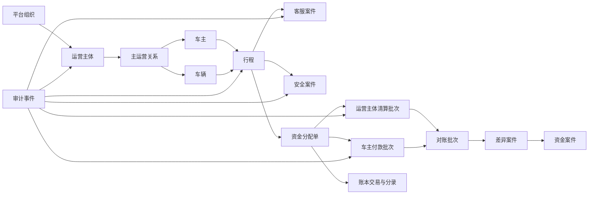

# 运营控制台核心实体与领域关系

## 建模原则

- 控制台只组合领域事实，不复制权威状态。
- 同一个业务概念只使用一个规范名称。
- “案件”“任务”“批次”和“实体”必须区分。
- 聚合视图可以缓存，但不能成为权威事实源。

## 组织与授权实体

### 内部用户

代表获得后台访问资格的自然人。内部用户不等于普通产品账户，也不因职位自动获得全部权限。

### 内部组织

表示平台、运营主体或项目治理组织。运营主体数据范围必须绑定唯一组织标识。

### 角色授予

记录内部用户在特定组织、城市、资源范围和有效期内获得的功能角色。

### 临时授权

针对明确工单和目的，在有限时间内提升数据披露或操作范围的授权记录。

## 任务与案件实体

### 工作任务

需要由一个内部角色完成的受控工作单元，包含队列、所有权、截止时间、资源版本和允许动作。

### 业务案件

围绕一个问题持续收集事实、证据、任务和决定的容器。客服、安全、资金、合规和退出分别使用不同案件类型。

### 决定

对任务或案件作出的结构化结论，包含理由、影响、经办人、复核人和版本。

### 审计事件

记录访问、披露、认领、转派、决定、重放、导出和权限变化的不可修改证据。

## 运营实体

### 运营主体

与平台签约并负责其名下车主运营管理、车主付款、退款协作和结算资料的企业主体。

### 主运营关系

车主、城市和车辆在一个有效期内唯一用于接单和结算的运营主体归属。

### 车主

具备车主身份和相应资格的产品账户。后台车主视图是多个领域事实的聚合，不是新的车主主数据。

### 车辆

经过资料、权属、保险和审核约束的运营资源。

### 行程

乘客请求、匹配、接单、履约、取消和责任状态的权威业务记录。

## 资金实体

### 资金分配单

将订单可分配金额确认为平台 `15%`、运营主体 `45%` 和车主 `40%` 经济权益的不可变结果。

### 运营主体清算批次

按运营主体和账务日聚合已通过门禁的分配项形成的外部清算控制单元。

### 车主付款批次

按运营主体、车主和付款日聚合 `T+1` 合格应付款形成的双人复核控制单元。

### 对账批次

对业务订单、支付聚合、复式账本和支付机构账单执行逐笔与汇总核对的运行记录。

### 差异案件

对账发现的非零金额、未知结果、缺失记录、重复记录或时间差的受控处置记录。

### 资金案件

因付款失败、资金不足、退款追偿、账户异常或主体退出产生的调查与处置记录。

### 账本交易

由确定业务事件产生的一组平衡分录，是资金变化的权威记录。

## 关键关系图

## 实体 360° 页面边界

### 运营主体 360°

可聚合：

- 主体资料和能力；
- 城市范围；
- 内部人员和角色；
- 车主和车辆摘要；
- 行程和服务指标；
- 清算、付款和风险摘要；
- 开放案件和审计。

不得维护：

- 独立主体余额；
- 可编辑清算金额；
- 跨主体资金池。

### 车主 360°

可聚合：

- 账户和资格摘要；
- 主运营关系；
- 车辆；
- 行程；
- 服务质量；
- 安全限制；
- 应付款和付款状态；
- 案件。

不得显示：

- 其他车主数据；
- 无关乘客敏感信息；
- 可直接修改的车主余额。

### 行程 360°

可聚合：

- 时间线；
- 参与者和运营主体快照；
- 价格和规则快照；
- 取消责任；
- 支付、退款和分配引用；
- 客服与安全案件。

不得提供自由状态编辑器。

## 状态所有权

| 状态 | 权威领域 | 控制台职责 |
| --- | --- | --- |
| 车主资格 | 资格领域 | 展示、任务和受控命令 |
| 车辆审核 | 审核领域 | 审核任务和决定 |
| 行程状态 | 行程领域 | 监控和受控恢复 |
| 安全冻结 | 安全领域 | 案件和双人恢复 |
| 支付与退款 | 支付聚合 | 查询和恢复任务 |
| 资金余额 | 复式账本 | 只读查询 |
| 对账差异 | 对账领域 | 处置和复核 |
| 运营主体状态 | 运营主体领域 | 入驻、限制和退出任务 |

