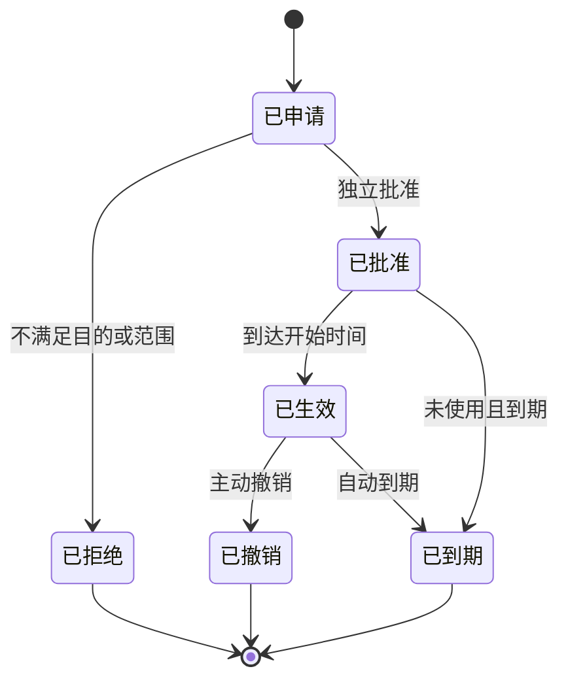

# 阶段一多组织权限与审计契约

## 冻结结论

阶段一采用统一内部身份、组织成员关系、功能角色绑定、显式作用域和服务端组织上下文组合授权。不存在备用授权模型，也不得在编码阶段引入超级管理员、前端范围过滤或运营主体独立后台权限系统。

权威机器契约：

- `spec/admin/internal-access-control.yaml`
- `spec/admin/audit-event-model.yaml`
- `spec/tests/admin-multi-organization-scenarios.yaml`

高风险决策：

- `docs/decisions/0015-运营控制台多组织授权与审计模型.md`

## 核心对象

| 对象 | 唯一职责 | 不得承担 |
| --- | --- | --- |
| 内部用户 | 表示经过内部认证的自然人 | 直接持有跨组织权限 |
| 组织成员关系 | 连接内部用户与一个内部组织 | 隐式授予功能权限 |
| 功能角色绑定 | 表示可承担的任务职责 | 自动扩大城市或主体范围 |
| 作用域绑定 | 限定城市、主体、资源类型或具体资源 | 改变功能角色 |
| 组织上下文 | 表示本次会话正在使用的获批范围 | 充当客户端自报权限 |
| 临时授权 | 在工单、目的和时限内缩小授权例外 | 绕过职责分离或功能门禁 |
| 授权判定 | 对一次请求给出允许或拒绝结果 | 被前端缓存为长期权限 |
| 审计事件 | 追加记录身份、范围、披露和操作事实 | 保存严格敏感原文 |

## 组织上下文规则

### 平台

- 可以在显式授权的城市和运营主体观察范围之间切换。
- 切换后功能角色和最大数据等级保持不变。
- 跨主体操作仍需动作权限、资源状态和职责分离同时满足。

### 运营主体

- 组织主体固定，界面不提供主体切换。
- 只能在本主体获批城市范围内切换。
- Server 和 Repository 必须始终附加固定 `operator_id` 范围。

### 项目治理

- 仅进入聚合、脱敏、只读上下文。
- 钻取不得扩大数据范围。
- 日常经办必须使用独立成员关系、独立会话目的和独立审计。

## 临时授权生命周期



临时授权必须包含：

- 工单；
- 结构化业务目的；
- 明确动作、资源或字段集合；
- 独立批准人；
- 开始和到期时间；
- 最大数据等级；
- 撤销原因。

## 授权判定顺序

1. 验证内部会话与保证等级。
2. 验证活动成员关系。
3. 解析服务端组织上下文。
4. 验证功能角色与动作。
5. 验证城市、主体和资源范围。
6. 验证资源状态和业务目的。
7. 验证数据等级与临时授权。
8. 验证职责分离和关联利益冲突。
9. 验证功能门禁与生产关闭态。
10. 生成 `access_decision_id` 和审计事件。

任何一步失败均拒绝，且不得通过隐藏错误或降级为全量查询继续执行。

## 审计事件最小结构

```text
event_id
event_type
occurred_at
actor_internal_user_id
actor_membership_id
organization_type
organization_id
session_id
request_id
correlation_id
access_decision_id
resource_type
resource_id
action
purpose
result
payload_digest
```

数据披露事件只记录字段标识和数据等级，不记录未遮蔽字段值。

## 页面设计约束

- 全局顶部持续显示环境、组织上下文、城市范围和当前功能角色。
- 运营主体页面持续显示固定主体，不出现主体切换控件。
- 未授权模块从导航移除，但深链接拒绝态必须可设计和测试。
- 临时授权必须显示剩余有效期、目的和工单。
- 所有范围切换、披露和拒绝结果都提供审计反馈。
- 阶段一运营主体名录只读，不出现创建、激活或编辑主按钮。

## 阶段一退出条件

- 三份机器契约通过静态检查。
- 二十项多组织验收场景覆盖主体隔离、深链接、临时授权、职责分离和审计。
- 平台工作台、运营主体工作台和运营主体只读名录高保真设计完成。
- 真实内部账号、真实运营主体账号、真实敏感数据和生产启用继续关闭。
